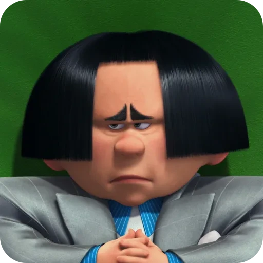
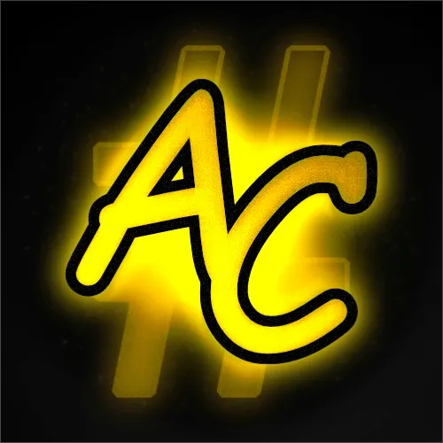
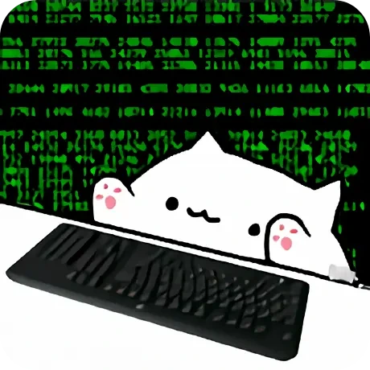
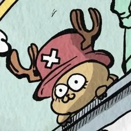

# Credits

--------------

**Theme Café Docs**

{ width="200" }
/// caption
Gatto
///

{ width="200" }
/// caption
dewgong64
///

**Wii U Homebrew Devs**

{ width="200" }
/// caption
Nathaniel
///

{ width="200" }
/// caption
Alpha Craft
///

{ width="200" }
/// caption
DanielKO
///

{ width="200" }
/// caption
Juanen
///

**Themezer**

{ width="200" }
/// caption
Migush
///

**Special Thanks**

{ width="200" }
/// caption
Perrohuevo
///

- [wiki.hacks.guide](https://wiki.hacks.guide/wiki/Wii_U:Custom_themes) for some of the information in this page.

- [Marcrobledo](https://www.marcrobledo.com/) for [RomPatcher.js](https://www.marcrobledo.com/RomPatcher.js/).

- [Themezer](https://themezer.net/).

Theme Café Docs was built with [Zensical](https://zensical.org/)
