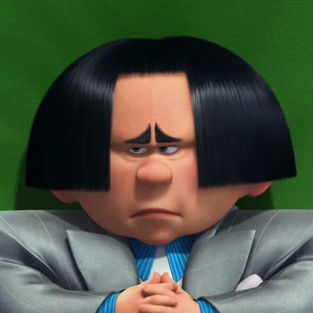

# Credits

--------------

Theme Café Docs Maintainers

{ width="200" }
/// caption
Gatto
///

{ width="200" }
/// caption
dewgong64
///

Wii U App Developers

{ width="200" }
/// caption
Alpha Craft
///

{ width="200" }
/// caption
Nathaniel
///

Plugin Developers

{ width="200" }
/// caption
DanielKO
/// caption
System Font Replacer
///
///

{ width="200" }
/// caption
Juanen
/// caption
StyleMiiU Plugin
///
///

Themezer Developer

{ width="200" }
/// caption
Migush
///

Special Thanks

{ width="200" }
/// caption
Perrohuevo
/// caption
Theme Cafe Owner
///
///

{ width="200" }
/// caption
ilovesplatoon8
/// caption
Moderator
///
///

Credits to [wiki.hacks.guide](https://wiki.hacks.guide/wiki/Wii_U:Custom_themes) for some of the information in this page

This page was made with [Materials for MkDocs](https://squidfunk.github.io/mkdocs-material/)