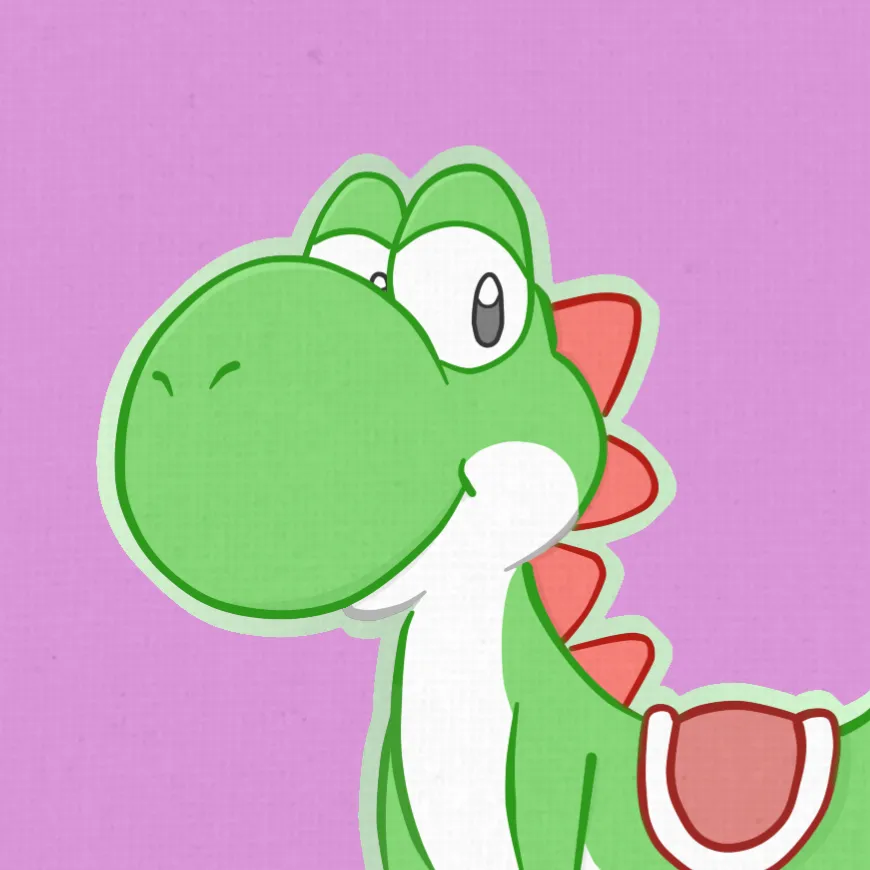

# Credits

--------------

**Theme Café Docs Maintainers**

{ width="200" }
/// caption
★ Gatto ★
///

{ width="200" }
/// caption
dewgong64
///

**Wii U App Developers**

{ width="200" }
/// caption
Xziip
///

{ width="200" }
/// caption
Nathaniel
///

{ width="200" }
/// caption
Alpha Craft
///

**Plugin Developers**

{ width="200" }
/// caption
DanielKO
/// caption
System Font Replacer
///
///

{ width="200" }
/// caption
Juanen
/// caption
StyleMiiU Plugin
///
///

**Themezer**

{ width="200" }
/// caption
Migush
///

**Special Thanks**

{ width="200" }
/// caption
Perrohuevo
/// caption
Theme Café Owner
///
///

- [wiki.hacks.guide](https://wiki.hacks.guide/wiki/Wii_U:Custom_themes) for some of the information in this page

- [Marcrobledo](https://www.marcrobledo.com/) for [RomPatcher.js](https://www.marcrobledo.com/RomPatcher.js/)

- [Themezer](https://themezer.net/) for hosting Wii U Themes

Theme Café Docs was made with [Zensical](https://zensical.org/)