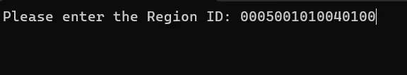
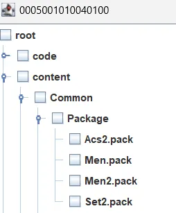

---
hide:
  - toc
icon: material/file
---

# Menu Files

--------------

First, we need to obtain the menu files, either through FTP or by using JNUSTool

- [FTP](#ftp)
- [JNUSTool](#jnustool)

=== "FTP"

    ## Retrieving Menu Files Through FTP

    ### What you need

    - [FTPiiU plugin](https://github.com/wiiu-env/ftpiiu_plugin/releases/tag/v0.3.1)

    Now depending on your operative system select a FTP client:

    - Windows: [WinSCP](https://winscp.net/eng/download.php).
    - MacOS: [Cyberduck](https://cyberduck.io/download/).
    - Linux: Nautilus or Dolphin, the file explorers for GNOME and KDE respectively .
        - if not usable, use [gFTP](https://github.com/masneyb/gftp/releases/tag/2.9.1b) instead.
    - Android: [File Manager](https://play.google.com/store/apps/details?id=com.alphainventor.filemanager).

    ### Guide

    - Use the IDS below on step 7, the folder name will change depending by the region of your console.
        - USA: `10040100`
        - EUR: `10040200`
        - JPN: `10040000`

    Step by step guide

    1. Turn on your console without any custom theme. (This will cause issues when getting the files we need.)
    2. Press L + DPAD Down + Select and search for FTPiiU Plugin.
    3. Press Settings and enable everything.
    4. On your PC open the FTP client.
    5. It will ask for your Console IP and Port Number you can see these details on your console. This is a local IP address, so it doesn't matter.
    6. It will ask for a user and a password, leave it blank, just accept.
    7. Now navigate to `storage_mlc` > `sys` > `title` > `00050010` > (This depends on the region of your console) > `content` > `Common` > `Package`
    8. Select `Men.pack` and `Men2.pack`, then click Download.
    9. It will ask for a place to download the files, it's recommended to create a specific folder to save the content.
    10. Now do the same but with `cafe_barista_men.bfsar`, Go back and then navigate to `Sound` > `Men`.
    11. Download `cafe_barista_men.bfsar`.

    !!! abstract "Credits to [wiki.hacks.guide](https://wiki.hacks.guide/wiki/Wii_U:Custom_themes) for the information in this section."

=== "JNUSTool"

    ## Using JNUSTool to Download Menu Files

    This is useful in case you lost your original Wii U menu files.

    ### What you need

    - otp.bin.
        - It's already in your sd card if you're using aroma.
        - `SD:\wiiu\backups\SERIAL_NUMBER\otp.bin`.
    - [JNUSTool](https://github.com/Maschell/JNUSTool/releases/tag/0.3b).

    ### **Getting the Wii U Common Key**

    <ul>
        <li>
            <label for="upload">Upload otp.bin: </label>
            <input type="file" id="upload">
            <ul id="keyItems" style="visibility: hidden;">
                <li>
                    <label for="cmnKey">Common Key - </label>
                    <code id="cmnKey"></code>
                </li>
            </ul>
        </li>
    </ul>
    <script src="../scripts/otp.js"></script>
    
    ### **Setting up JNUSTool**

    Open the JNUSTool folder and open the file `config`, then replace `[COMMON KEY]` with the Common Key from the previous step.

    ``` title="config" hl_lines="2"
    http://ccs.cdn.wup.shop.nintendo.net/ccs/download
    [COMMONKEY]
    updatetitles.csv
    https://tagaya.wup.shop.nintendo.net/tagaya/versionlist/EUR/EU/latest_version
    https://tagaya-wup.cdn.nintendo.net/tagaya/versionlist/EUR/EU/list/%d.versionlist
    ```

    ### **Running command**
    Make a command.bat file inside the JNUSTool folder and paste this

    ``` bat
    @echo off
    set /p id="Please enter the Region ID: "
    java -jar JNUSTool.jar %id% -dl
    pause
    ```

    Run the command and type the region ID.

    - USA: `0005001010040100`
    - EUR: `0005001010040200`
    - JPN: `0005001010040000`

    *Example with USA region*

    

    ### **Downloading files**

    Go into `root/content/Common/Package` and download `Men.pack` and `Men2.pack`.

    

    Go into `root/content/Common/Sound/Men` and download `cafe_barista_men.bfsar`.

-----------------

[Continue to Patching → ](patching.md){ .md-button .md-button--primary }
