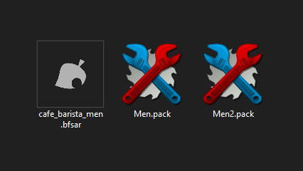

---
hide:
    toc
---

# Install

--------------

!!! warning "Disclaimer"

    We are not responsible for what you do with your console. These guides make use of [Aroma CFW](https://aroma.foryour.cafe/) and [StyleMiiU Plugin](https://github.com/Themiify-hb/StyleMiiU-Plugin) to load custom themes which **does not modify the Wii U System Files**.

-   **Utheme (Recommended!)**

    

    Install themes directly from your Wii U.

    [Go :material-arrow-right:](utheme.md){ .md-button .md-button--primary }

-   **Manual Installation**

    

    Manually load themes using StyleMiiU or SDCafiine.

    [Go :material-arrow-right:](files.md){ .md-button .md-button--primary }

--------------

- [**UTheme**](utheme.md): Install themes directly from your Wii U.

- [**Menu Files**](files.md): You can get your menu files with [FTP](files.md#ftp) or [JNUSTool](files.md#jnustool).

- [**Patching**](patching.md): To patch your `.ips, .bps, .ups, .ppf, .aps` or `.rup` files.

- [**Loading Custom Themes**](loading.md): To load your custom theme, you can use [StyleMiiU-Plugin](loading.md#stylemiiu-plugin) (Recommended) or [SDCafiine](loading.md#sdcafiine).

- [**Custom Fonts**](fonts.md): To use custom fonts on your console.

- [**Splash Screen**](splash.md): You can add a custom image when booting up your console.

--------------

!!! abstract "Credits to [wiki.hacks.guide](https://wiki.hacks.guide/wiki/Wii_U:Custom_themes) for some of the information in this page."