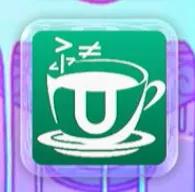

# Themiify

!!! abstract "Credits to [Nathaniel](https://github.com/Fangal-Airbag) and [AlphaCraft](https://github.com/AlphaCraft9658) for creating this app"

Themiify is a homebrew application that allows for on the fly installation of Wii U System Menu themes without the need for users to use external tools like Rom Patcher JS to get their theme files.

Themiify searches `SD:/wiiu/themes` for Wii U Theme Archive files (`.utheme`) and installs the contents of the theme archive as an SDCafiine modpack. Once a theme is installed a user can select it via the SDCafiine modpack selector.

!!! info "**No system file is modified by this app.**"

## What you need

- A modded Wii U with [Aroma](https://wiiu.hacks.guide/aroma/getting-started.html)
- [Themiify](https://github.com/Themiify-hb/Themiify/releases)
- [StyleMiiU Plugin](https://github.com/Themiify-hb/StyleMiiU-Plugin/releases)
- Your theme with the extension `.utheme` 
    - These can be obtained in [Themezer](https://themezer.net/wiiu/themes) or within Themiify

??? question "About the use of StyleMiiU"

    StyleMiiU works by loading themes safely via the SD Card. Themiify installs the files on the SD Card for StyleMiiU to load, if you do not have the [StyleMiiU Plugin](https://github.com/Themiify-hb/StyleMiiU-Plugin/releases) installed, no changes will be made and you will not see any custom theme

## Installation

1. Download [Themiify](https://github.com/Themiify-hb/Themiify/releases) and copy the `Themiify.wuhb` file to `SD:/wiiu/apps`.
2. Copy your `.utheme` file to `SD:/wiiu/themes`
3. Turn on your Wii U and boot aroma
4. Open the Themiify app

    

!!! warning "Under Construction"

!!! success

    You have succesfully installed a custom theme

    

??? info "Fonts"

    If you want to use custom fonts, follow [Fonts](fonts.md)

??? warning "Troubleshooting"

    - If you're stuck on a black screen follow [Black Screen](../troubleshooting.md#black-screen)

    - If your console freezes on the Wii U Menu loading screen follow [Freezing](../troubleshooting.md#freezing)

    - If your theme didn't load and it's showing the stock one follow [Theme not loading](../troubleshooting.md#theme-not-loading)

    - If the console is bootlooping on the "Wii U Menu" splash screen, you can follow [Wii U Menu Bootloop](../troubleshooting.md#wii-u-menu-bootloop)
