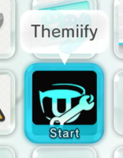
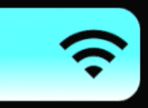
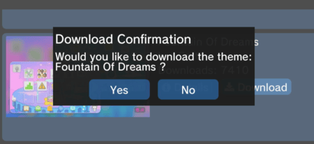
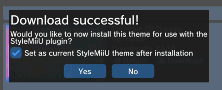
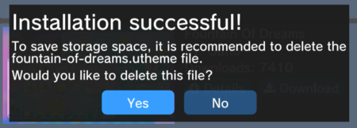
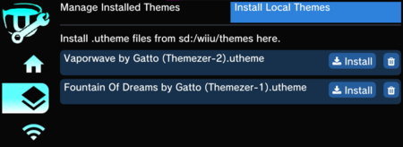
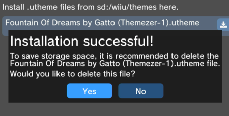
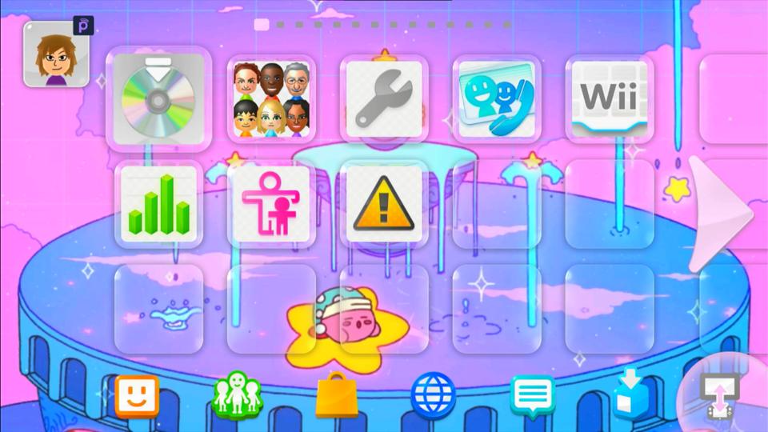

# Themiify

Themiify is a homebrew application that allows for on the fly installation of Wii U Menu themes via the [Themezer](https://themezer.net/) API or via `.utheme` files placed on an SD Card. 
Once a theme is installed [StyleMiiU](https://github.com/Themiify-hb/StyleMiiU-Plugin) will read the theme and show it the next time the Wii U Menu is loaded.

!!! info "**No system file is modified by this app.**"

--------------

## What you need

- A modded Wii U with [Aroma](https://wiiu.hacks.guide/aroma/getting-started.html).
- [Themiify](https://github.com/Themiify-hb/Themiify/releases) (Also available in the [Homebrew App Store](https://hb-app.store/wiiu/Themiify)).
- [StyleMiiU Plugin](https://github.com/Themiify-hb/StyleMiiU-Plugin/releases) (Also available in the [Homebrew App Store](https://hb-app.store/wiiu/StyleMiiU)).
- Your Wii U Theme with the extension `.utheme`. (Optional)
    - These can be obtained from [Themezer](https://themezer.net/wiiu/themes).

## Installation

1. Download [Themiify](https://github.com/Themiify-hb/Themiify/releases) and copy the `Themiify.wuhb` file to `SD:/wiiu/apps/`.
2. Download [StyleMiiU Plugin](https://github.com/Themiify-hb/StyleMiiU-Plugin/releases) and copy the file `stylemiiu.wps` to `SD:/wiiu/environments/aroma/plugins`.
3. If you have it, copy your `.utheme` file(s) to `SD:/wiiu/themes/` (This is used for [Local Installation](#local-installation)).

## Installing Themes

=== "Network Installation"

    ### Downloading and Installing Themes (Network)

    1. Turn on your Wii U and boot aroma.
    2. Open Themiify.

        

    3. Select the Network tab.

        

    4. Choose the theme you want to download.
        - You can also see a preview of the theme by selecting Details.

    5. Confirm the download of the theme with `Yes`.

        

    6. After the download is finished, select `Yes` to install the theme.

        

        !!! info "If you decide to not install the theme right away, you will be able to install it later via [Local Installation](#local-installation)."

    7. After the installation is finished, you will be asked to delete the `.utheme` theme archive of the theme you just installed, do so to save storage space.

        

        !!! warning "If you see "Installation unsuccessful!" go to [Check integrity of Wii U Menu Files](#check-integrity-of-wii-u-menu-files)"

    8. Press `B` and select the Exit button.

        

=== "Local Installation"

    ### Installing Themes Locally

    You can install themes locally by placing your `.utheme` theme archive files in `SD:/wiiu/themes/`.

    1. Turn on your Wii U and boot aroma.
    2. Open Themiify.
    3. Select the Local Themes Tab and select Install Local Themes.

        

    4. Install your previously downloaded `.utheme` file.
    5. After the installation is finished, you will be asked to delete the `.utheme` theme archive of the theme you just installed, do so to save storage space.

        

    6. Press `B` and select the Exit button.

        

!!! success

    You have succesfully installed a Custom Theme for your Wii U.

    

!!! tip "If you want to use custom fonts, follow [Fonts](fonts.md)."

!!! tip "If you want to use a Splash Screen follow [Splash Screen](splash.md)"

!!! failure "If you have any other issues while using Themiify, please join our [Discord Server](https://discord.com/invite/2DNvH9db2A) for support."

--------------

## Settings

### Check Integrity of Wii U Menu Files

This setting checks your if Wii U Menu files have been modified before, if this is the case, Themiify will not be able to install themes correctly, to solve this

1. Use [JNUSTool](files.md#jnustool) to get the original Wii U Menu files.
2. Copy `Men.pack`, `Men2.pack` to `SD:/themiify/cache/Common/Package/`.
3. Copy `cafe_barista_men.bfsar` to `SD:/themiify/cache/Common/Sound/Men/`.

After that, you should be able to use Themiify normally.

### Dump Wii U Menu Files

This setting allows for dumping of the Wii U Menu files commonly used for theming, this includes:

- `Men.pack` & `Men2.pack`: Most of the important menu assets are stored here.
- `cafe_barista_men.bfsar`: Used for [Custom Music](../themecreation/music/index.md) or Sound Effects.
- `AllMessage.szs` (Optional): This files stores the menu text for each individual language and can be used for [Custom Text](../themecreation/advanced/text.md).

To create custom themes, use this option to dump the files and get started with [Theme Creation](../themecreation/index.md).

--------------

!!! abstract "Credits to [Nathaniel](https://github.com/Fangal-Airbag), [Alpha Craft](https://github.com/AlphaCraft9658), [Daniel K. O.](https://github.com/dkosmari) & contributors for [Themiify](https://github.com/Themiify-hb/Themiify)"
