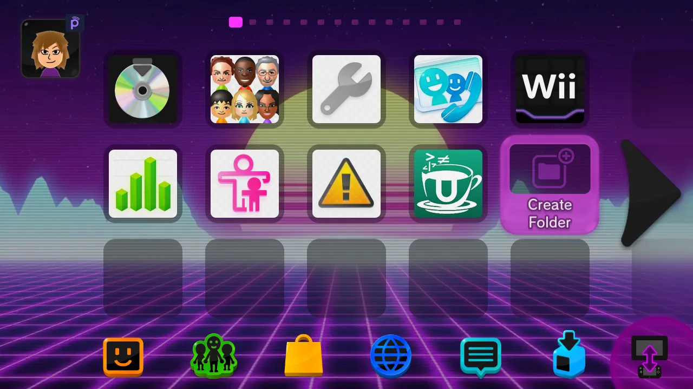

# Themiify

!!! abstract "Credits to [Nathaniel](https://github.com/Fangal-Airbag) and [AlphaCraft](https://github.com/AlphaCraft9658) for creating this app."

Themiify is a homebrew application that allows for on the fly installation of Wii U System Menu themes without the need for users to use external tools.

Themiify searches `SD:/wiiu/themes` for Wii U Theme Archive files (`.utheme`) and installs the contents of the theme archive on the same directory. Once a theme is installed [StyleMiiU](https://github.com/Themiify-hb/StyleMiiU-Plugin/releases) will read the theme and show it next time the Wii U Menu is loaded.

!!! info "**No system file is modified by this app.**"

## What you need

- A modded Wii U with [Aroma](https://wiiu.hacks.guide/aroma/getting-started.html).
- [Themiify](https://github.com/Themiify-hb/Themiify/releases).
- [StyleMiiU Plugin](https://github.com/Themiify-hb/StyleMiiU-Plugin/releases).
- Your theme with the extension `.utheme`.
    - These can be obtained from [Themezer](https://themezer.net/wiiu/themes) or within Themiify in the future.

## Installation

1. Download [Themiify](https://github.com/Themiify-hb/Themiify/releases) and copy the `Themiify.wuhb` file to `SD:/wiiu/apps`.
2. Download [StyleMiiU Plugin](https://github.com/Themiify-hb/StyleMiiU-Plugin/releases) and copy the file `stylemiiu.wps` to `SD:/wiiu/environments/aroma/plugins`.
3. Copy your `.utheme` file to `SD:/wiiu/themes`.
4. Turn on your Wii U and boot aroma.
5. Open Themiify.
6. Click `Install Theme`.
7. Select the theme you want to install.
8. Press `A` to continue with the installation (This will take a couple of seconds).
9. Press `X` to delete the `.utheme` file.
10. Press `B` to go back to the main menu and quit the app.

!!! success

    You have succesfully installed a custom theme

    

!!! info "If you want to use custom fonts, follow [Fonts](fonts.md)" 

!!! warning ""

    If your theme is crashing your console go to [Installed with issues](../troubleshooting.md#theme-installed-successfully-but-theres-issues)

    If you were unable to install any themes go to [Unable to install theme](../troubleshooting.md#there-may-be-a-problem-with-the-theme-themiify)