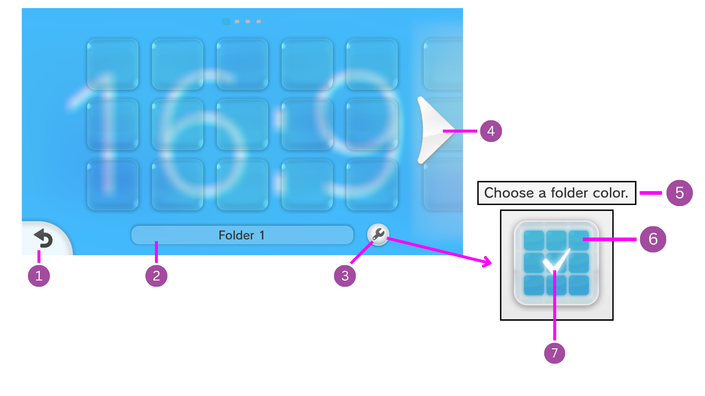
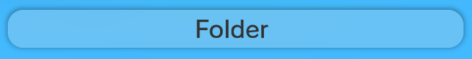
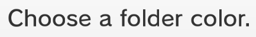
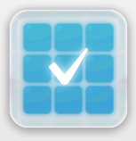

# Folder

--------------------------------

### 1. Back Button

`Men2.pack > Layout > BtnFolderCornerLBW.szs > BtnFolderCornerLBW.bflyt`

You can change the [Color](../general/colors.md) / [Texture](../general/textures.md) of this by changing the materials 

- `W_Btn_00LT` for the main button.
- `W_BtnSelect_00LT` for the button when selected.
- `P_Pict_00` & `P_Pict_01` for the arrow.

--------------------------------

### 2. Folder Name Button

You can change the color of this

??? note "Text: First Time Enter"

	Located in `Men2.pack > Layout > FolderBase.szs > FolderBase.bflyt`.

	- Go to `QuickAccess > Part Panes > L_FolderName > T_Text_00  > Text Pane > Font` and change the color.

??? note "Text: Decide, Select & Unselect"

	Located in `Men2.pack > Layout > BtnFolderName.szs > BtnFolderName.bflyt`.

	1. Go to Animation Hierarchy.
	2. Select the animation you want to modify:

	 	- `BtnFolderName_Decide.bflan`
		- `BtnFolderName_Select.bflan`
		- `BtnFolderName_Unselect.bflan`

	3. Go to `T_Text_00 > Vertex Color`
	4. Change the values of the following targets:

	    - `LeftTopRed`
		- `LeftTopGreen`
		- `LeftTopBlue`
		- `LeftBottomRed`
		- `LeftBottomGreen`
		- `LeftBottomBlue`
	
	??? question "What values do I use?"

        You can get your color in Hexadecimal values.

        For example Pink (#FF8DA1).

        Then convert the RGB values to Decimal.

        - FF = 255 for Red.
        - 8D = 141 for Green.
        - A1 = 161 for Blue.
	
??? note "Base Color"

	Located in `Men2.pack > Layout > BtnFolderName.szs > BtnFolderName.bflyt`.

	**First Time Enter**

	- Go to `RootPane > W_Base_00`.
	- Select the Window Pane Tab.
	- Change the Vertex Colors.
	
	**Decide, Select & Unselect**

	1. Go to Animation Hierarchy.
	2. Select the animation you want to modify:

	    - `BtnFolderName_Decide.bflan`.
	 	- `BtnFolderName_Select.bflan`.
		- `BtnFolderName_Unselect.bflan`.
	
	3. Go to `W_Base_00 > Vertex Colors`.
	4. Change the respective RGBA values for each corner.
	
	??? question "What values do I use?"

        You can get your color in Hexadecimal values

        For example Pink (#FF8DA180)

        Then convert the RGBA values to Decimal

        - FF = 255 for Red
        - 8D = 141 for Green
        - A1 = 161 for Blue
		- 80 = 128 for Alpha

??? note "Shadow"

	Located in `Men2.pack > Layout > BtnFolderName.szs > BtnFolderName.bflyt`.
	
	**Decide, Select & Unselect**

	1. Go to Animation Hierarchy.
	2. Select the animation you want to modify:

	    - `BtnFolderName_Decide.bflan`.
	 	- `BtnFolderName_Select.bflan`.
		- `BtnFolderName_Unselect.bflan`.
	
	3. Change the Material Color for `W_Shdw_00C`, `W_Shdw_00LT`, `W_Shdw_00RT`, `W_Shdw_00LB`, `W_Shdw_00RB` .

--------------------------------

### 3. Folder Settings Button

`Men2.pack > Layout > BtnFolderSettings.szs > BtnFolderSettings.bflyt`

You can change the [Color](../general/colors.md) / [Texture](../general/textures.md) of this by changing the materials.

- `P_Shadow_00` for the outer shadow.
- `P_Shadow_01` for the inner shadow.
- `P_Pict_01` for the color of the button.
- `P_PictSetting_00` & `P_PictSetting_01` for the wrench icon.

--------------------------------

### 4. Folder Arrow

`Men2.pack > Layout > BtnSlideFolder.szs > BtnSlideFolder.bflyt`

You can change the [Color](../general/colors.md) / [Texture](../general/textures.md) of this by changing the materials.

- `P_BtnSlideR` for the right arrow.
- `P_BtnSlideL` for the left arrow.

??? info "Removing the blur"

	Right arrow

	- Go to `RootPane > N_BgR > PF_RBtnMask`.
	- Click on the `Pane` tab.
	- Uncheck `Pane visible`.

	Left arrow

	- Go to `RootPane > N_BgL > PF_LBtnMask`.
	- Click on the `Pane` tab.
	- Uncheck `Pane visible`.

--------------------------------

### 5. Choose a folder color Text

`Men2.pack > Layout > DialogFolderColor.szs > DialogFolderColor.bflyt`

You can change the Color of this.

- Go to `RootPane > N_Contents > T_Text_00 > Text Pane > Font` and change the color.

--------------------------------

### 6. Folder Color Button

`Men2.pack > Layout > BtnFolderColor.szs > BtnFolderColor.bflyt`

You can change the [Textures](../general/textures.md) of this.

- `P_IconFolder_00`, `P_IconFolder_01` & `P_IconFolder_02` for the folder icon.

### 7. Checkmark

`Men2.pack > Layout > BtnFolderColor.szs > BtnFolderColor.bflyt`

You can change the [Color](../general/colors.md) / [Texture](../general/textures.md) of this by changing the material `Checkmark`.