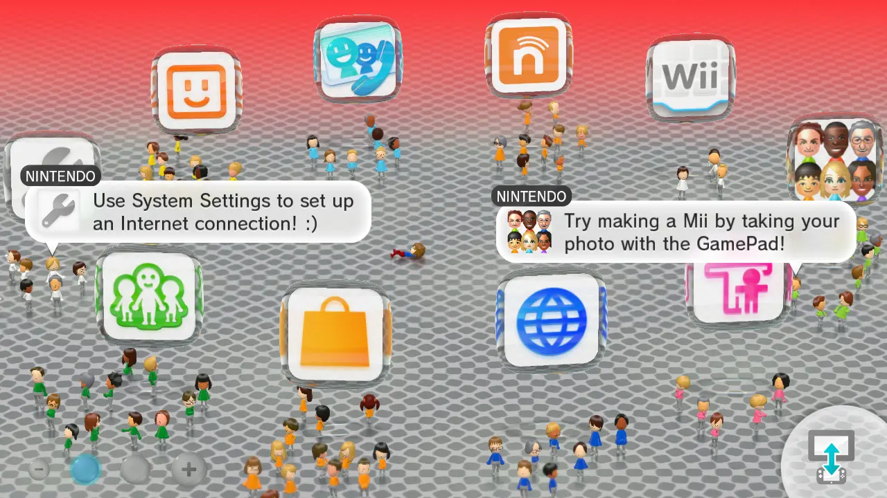

# Advanced

*Make sure to regularly make backups of your theme in case it starts crashing for whatever reason*

-   **Launcher**

    

    [Go :material-arrow-right:](launcher.md){ .md-button .md-button--primary }

-   **Wara Wara Plaza**

    

    [Go :material-arrow-right:](wwp.md){ .md-button .md-button--primary }

-   **User Select**

    

    [Go :material-arrow-right:](userselect.md){ .md-button .md-button--primary }

-   **Menu Text**

    

    [Go :material-arrow-right:](text.md){ .md-button .md-button--primary }

