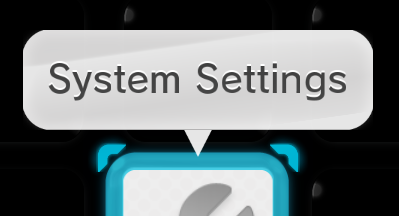

## Table of contents

1 - [Background](#1-background)

2 - [Applets](#2-applets)

3 - [Usb Indicator](#3-usb-indicator)

4 - [Start (Applets)](#4-start-applets)

5 - [Select Frame](#5-select-frame)

6 - [Active Frame](#6-active-frame)

7 - [Button Swap](#7-button-swap)

8 - [Button Swap Icons](#8-button-swap-icons)

9&10 - [Arrows](#9-10-arrows)

11 - [Page Indicator](#11-page-indicator)

12 - [Folder](#12-folder)

13 - [Folder Create](#13-folder-create)

14 - [LauncherIcon](#14-launcher-icon)

15 - [Wii Menu Icon](#15-wii-menu-icon)

16 - [Disc Icon](#16-disc-icon)

17 - [Network Icon](#17-network-icon)

18 - [Account Button](#18-account-button)

19 - [Wii Cursor](#19-wii-cursor)

20 - [Balloon Text](#20-balloon-text)

--------------------------------

### 1. Background
    
`Men2.pack` > `Model` > `LoungeVR.szs`

This is where the background image/animation is located

{ width="426" height="240" }

[Template Guide](../themes/template.md){ .md-button .md-button--primary }

<video controls width="426" height="240">
<source src="../../themes/imgs/frame/vf.mp4" type="video/mp4">
</video>

[Animations Guide](../themes/anim.md){ .md-button .md-button--primary }

??? info "Info"

    This only applies when using patches provided by the docs

----------------------

### 2. Applets

`Men2.pack` > `Layout` > `OverlayAppBase.szs`

This is where the App Icons at the bottom of the menu are located

You can change the [Color](../general/colors.md) / [Texture](../general/textures.md) of this by changing the material `P_base` of each applet

----------------------

### 3. Usb Indicator

`Men2.pack` > `Layout` > `UsbIndicatorDrc.szs`

This is where the Usb Indicator is located

You can change the [Color](../general/colors.md) / [Texture](../general/textures.md) of this by changing the material `P_Usb`

----------------------

### 4. Start (Applets)

`Men2.pack` > `Layout` > `BtnOverlayApp_01.szs`

This is where `Start` from the applets is located

If you want to change the `Start` Color

Located on Men2.pack > BtnOverlayApp_01.szs

Change the [Color](../general/colors.md) of the material `T_title` and `OLAActiveFrame_00`

----------------------

### 5. Select Frame

`Men.pack` > `Layout` > `SelectFrame.szs`

You can change the [Color](../general/colors.md) / [Texture](../general/textures.md) of this by changing the material `W_SelectFrame_01LT` and `W_SelectFrame_00LT`

----------------------

### 6. Active Frame

`Men2.pack` > `Layout` > `LauncherIcon.szs`

This is the frame that shows up for creating a folder or starting an application

You can change the [Color](../general/colors.md) of this by changing the material `ActiveFrame_01`

----------------------

### 7. Button Swap

`Men.pack` > `Layout` > `BtnSwap_00.szs` , `BtnSwapDRC.szs`

??? note "***TV***"

    `BtnSwap_00.szs`

    You can change the [Color](../general/colors.md) / [Texture](../general/textures.md) of this by doing changes to the materials inside of the bflyt file 

??? note "***Gamepad***"

    `BtnSwapDRC.szs`

    You can change the [Color](../general/colors.md) of this by doing changes to the materials inside of the bflyt file

----------------------

### 8. Button Swap Icons

`Men.pack` > `Layout` > `BtnSwap_00.szs`

You can change the [Color](../general/colors.md) / [Texture](../general/textures.md) of this by doing changes to the materials inside of the bflyt file 

----------------------

### 9 10. Arrows

`Men2.pack` > `Layout` > `BtnSlideLauncher.szs`

`P_BtnSlideR`, `P_BtnSlideL`

??? note "Outside folders"

    Located in Men2.pack > BtnSlideLauncher.szs

    You can change the [Color](../general/colors.md) / [Texture](../general/textures.md) of this by changing the material `P_BtnSlideR` and `P_BtnSlideL`

    ??? info "Removing the weird blur"

        Right arrow

        - Go to `RootPane > PF_RBtnMask > P_Pict`
        - Click on the `Pane` tab
        - Uncheck `Pane visible`    

        Left arrow

        - Go to `RootPane > PF_LBtnMask > P_Pict_0`
        - Click on the `Pane` tab
        - Uncheck `Pane visible`

??? note "Inside folders"

    Located in Men2.pack > BtnSlideFolder.szs

    You can change the [Color](../general/colors.md) / [Texture](../general/textures.md) of this by changing the material `P_BtnSlideR` and `P_BtnSlideL`

    ??? info "Removing the weird blur"

        Right arrow

        - Go to `RootPane > PF_RBtnMask > P_Pict`
        - Click on the `Pane` tab
        - Uncheck `Pane visible`    

        Left arrow

        - Go to `RootPane > PF_LBtnMask > P_Pict_0`
        - Click on the `Pane` tab
        - Uncheck `Pane visible`

----------------------

### 11. Page Indicator

`Men2.pack` > `Layout` > `PageIndicator.szs`

??? "Active tab"

    You can change the [Color](../general/colors.md) of this by changing the material `P_Color`

??? "Inactive tab"

    You can change the [Color](../general/colors.md) of this by changing the material `P_Base`

----------------------

### 12. Folder

`Men2.pack` > `Layout` > `LauncherIcon.szs`

You can change the [Texture](../general/textures.md) of this by changing the material `P_IconFolder_01`

----------------------

### 13. Folder Create

`Men2.pack` > `Layout` > `LauncherIcon.szs`

You can change the [Texture](../general/textures.md) of this by changing the material `P_Folder`

----------------------

### 14. Launcher Icon

`Men2.pack` > `Layout` > `LauncherIcon.szs`

You can change the [Color](../general/colors.md) of this by changing the material `PF_LauncherBtnSpec_00`

----------------------

### 15. Wii Menu Icon

`Men2.pack` > `Model` > `SystemAppIcon.szs` > `Textures` > `AppIconWii`

You can change the [Texture](../general/textures.md) of this by [replacing](../general/exportimport.md#replace) the texture `AppIconWii`

----------------------

### 16. Disc Icon

`Men2.pack` > `Model` > `SystemAppIcon.szs` > `Textures` > `AppIconDisc`

You can change the [Texture](../general/textures.md) of this by [replacing](../general/exportimport.md#replace) the texture `AppIconDisc`

----------------------

### 17. Network Icon

`Men2.pack` > `Layout` > `BtnAccountSelect.szs`

You can change the [Texture](../general/textures.md) of this by changing the material `P_NetworkAccountMark_00`

----------------------

### 18. Account Button

`Men2.pack` > `Layout` > `BtnAccountSelect.szs`

You can change the [Texture](../general/textures.md) of this by doing changes to the materials inside of the bflyt file

If you want to change the color

- Open the `bflyt` file
- Go to `Rootpane > N_Active > N_Btn > P_Base`
- Select the `Picture pane` tab
- On `Vertex Colors` click `All`
- Change the color

If you want to change the color of the blue glow

- Change the [Color](../general/colors.md) of the material `ActiveFrame_01`

----------------------

### 19. Wii Cursor

`Men.pack` > `Layout` > `Cursor.szs`

??? note "Changing Textures"

    

    Go to `Men.pack` > `Layout` > `Cursor.szs` > `Cursor.arc`

    - Go to the `timg` folder
    - Click the texture you want to replace
    - Change the display to `File Editor` if you haven't

    

    - Click `File`
    - Click `Replace`

    

    Replace each texture you want to change

    Save

??? note "Changing Colors"

    

    Go to `Men.pack` > `Layout` > `Cursor.szs` > `Cursor.arc`

    - Go to the `anim` folder
    - Open `Cursor_CursorNumber.bflan`
    - In Animation Hierarchy open `Cursor_CursorNumber.bflan`
    - Go to `Animation Info` > `CursorBaseAlpha` > `MaterialColor`

    Each player has its own color in separate RGB decimal values

    

    - P1 uses frames 0 and 1
    - P2 uses frames 2 and 3
    - P3 uses frames 4 and 5
    - P4 uses frame 6

    Change the decimal values of the `WhiteColorRed`, `WhiteColorGreen` and `WhiteColorBlue` Key Frames for the player you want to modify

    ???+ example

        P1's color is `#008CFF` in hexadecimal

        You need to separate each RGB value and convert them from Hexadecimal to Decimal values

        - 00 = 0
        - 8C = 140
        - FF = 255

        Player 1 uses frames 0 and 1, in this case
        
        - `WhiteColorRed` in both Key Frames 0 and 1 should have the value 0
        - `WhiteColorBlue` in both Key Frames 0 and 1 should have the value 140
        - `WhiteColorGreen` in both Key Frames 0 and 1 should have the value 255

        If you want to change the color to pink (`#FF8DA1`) for P1

        Separate the values and convert them to Decimal

        - FF = 255
        - 8D = 141
        - A1 = 161

        and change

        - `WhiteColorRed` in both Key Frames 0 and 1 set the value 255
        - `WhiteColorBlue` in both Key Frames 0 and 1 set the value 141
        - `WhiteColorGreen` in both Key Frames 0 and 1 set the value 161

        Once you set the values, click `Save` on the `Cursor_CursorNumber.bflan` window, close this window, and click `Save` on the `Men.pack` window

        Finally, test your theme and you will see that the Cursor has changed from blue to pink

        
----------------------

### 20. Balloon Text

`Men2.pack` > `Layout` > `Balloon.szs` > `Balloon.bflyt`

You can change the [Color](../general/colors.md) of this by changing the materials:

- `W_BalloonC`
- `W_BalloonLT`
- `P_Tip`

----------------------