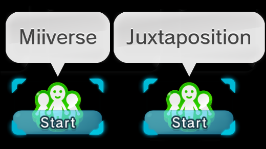

# Text

You can follow this guide if you want to modify any of the Wii U Menu's text files

This example will change the name of "Miiverse" to "Juxtaposition"

## What you need

- [3DLandMSBTeditor](https://github.com/IcySon55/3DLandMSBTeditor)

--------------

## Get your files

You will need the `AllMessage.szs` file for the language you want to edit, if you do not have this file you can obtain it using any of the methods from [Menu Files](../../install/files.md) and get the file from the following location

- For FTP: `storage_mlc > sys > title > 00050010 > (REGION) > content > (LANGUAGE) > Message > AllMessage.szs`
    - Depending on the region of your console, in `(REGION)` use
        - `10040100` for USA
        - `10040200` for EUR
        - `10040000` for JPN
    - In `(LANGUAGE)` use the language you want to edit
        - For example: `UsEnglish`

- For JNUSTool: `content > (LANGUAGE) > Message > AllMessage.szs`
    - In `(LANGUAGE)` use the language you want to edit
        - For example: `UsEnglish`

--------------

## Before Starting

- Make sure you make a backup of your original `AllMessage.szs` file(s) in case anything goes wrong

!!! failure "Do **NOT** edit the files using Switch Toolbox, if you do it will cause **A LOT** of issues"

--------------

## Exporting the text file

- Open your `AllMessage.szs` file with [Switch Toolbox](https://github.com/KillzXGaming/Switch-Toolbox/releases/tag/Final)
- Locate the file you want to edit (In this case `AllMessage.szs` > `SceneMessage.sarc` > `MenuScene.msbt`)
- Right click and `Export Raw Data`
- Save it on your device

--------------

## Editting the text file

- Open [MSBTeditor](https://github.com/IcySon55/3DLandMSBTeditor)
- Open the file you exported previously
- Go to the String you want to edit and change it
- Save

--------------

## Replacing the files

- Go back to Switch Toolbox
- Locate the file (In this case `AllMessage.szs` > `SceneMessage.sarc` > `MenuScene.msbt`)
- Right click and `Replace Raw Data`
- Save

!!! success "You are done!"

    
