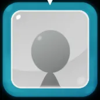
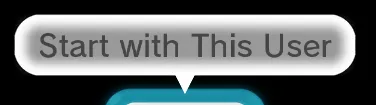
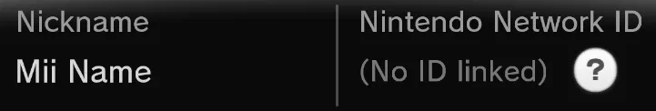

# User Select Screen

!!! note "For the file `AccountSelect`" 

    - Go to `Men2.pack` > `Common` > `Layout` > `AccountSelect`
    - Right click > Export Raw Data
    - Save it on your device
    - Open `AccountSelect.szs` *on a new Switch Toolbox window*
        - If you open it on the same window as you have your `Men2.pack`, Switch Toolbox will crash

----------------------

### 1. Account Button

`Men2.pack` > `Layout` > `BtnAccountSelect.szs`

You can change the [Texture(s)](../general/textures.md) of this

If you want to change the color

- Open the `bflyt` file
- Go to `Rootpane > N_Active > N_Btn > P_Base`
- Select the `Picture pane` tab
- On `Vertex Colors` click `All`
- Change the color

If you want to change the color of the blue frame

- Change the [Color](../general/colors.md) of the material `ActiveFrame_01`

----------------------

### 2. Start with This User

`Men2.pack` > `Layout` > `AccountBalloon.szs`

??? "Balloon"

    You can change the [Color](../general/colors.md) of this by changing the materials `W_Balloon` and `W_BalloonLT`

??? "Text"

    `RootPane` > `N_Trans` > `N_Scale` > `T_Balloon`

    - Go to `Text Pane` > `Font` and change the color

----------------------

### 2. Line

`Men2.pack` > `Layout` > `AccountSelect.szs`

You can change the [Color](../general/colors.md) of this by changing the material `P_Bg`

----------------------

### 3. Text

`Men2.pack` > `Layout` > `AccountSelect.szs` > `AccountSelect.bflyt` > `RootPane` > `N_Root`

- "Nickname" Text: `T_NameTitle`
- Mii Name: `T_Name`
- "Nintendo Network ID" Text: `T_NNIDTitle`
- User Network ID: `T_NNID`

To change the color of the text

- Select the one you want to change
- Go to `Text Pane` > `Font` and change the color

----------------------

### 4. Add New User Button

`Men2.pack` > `Layout` > `BtnCornerPlusRT.szs`

You can change the [Texture(s)](../general/textures.md) of this

You can change the [Color](../general/colors.md) of this by changing the material `W_Btn_00LT`