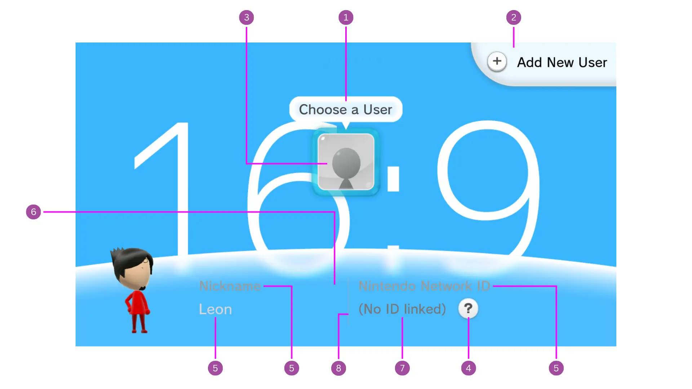
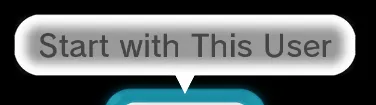
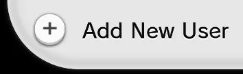
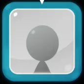
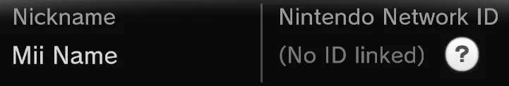
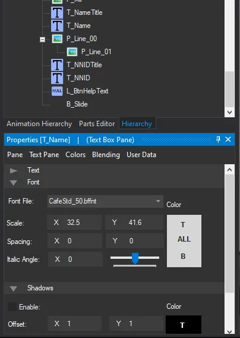
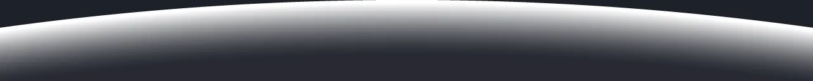
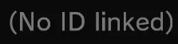
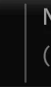

# User Select Screen

!!! note "For the file `AccountSelect`"

    - Go to `Men2.pack > Common > Layout > AccountSelect`
    - Right click > Export Raw Data
    - Save it on your device
    - Open `AccountSelect.szs` *on a new Switch Toolbox window*
        - If you open it on the same window as you have your `Men2.pack`, Switch Toolbox will crash

----------------------

### 1. Account Text Balllon

`Men2.pack > Layout > AccountBalloon.szs`

??? "Balloon"

    You can change the [Color](../general/colors.md) of this by changing the materials `W_Balloon` and `W_BalloonLT`

??? "Text"

    `RootPane > N_Trans > N_Scale > T_Balloon`

    - Go to `Text Pane > Font` and change the color

----------------------

### 2. Add New User Button

`Men2.pack > Layout > BtnCornerPlusRT.szs`

You can change the [Texture(s)](../general/textures.md#for-bflyt) of this.

You can change the material [Color](../general/colors.md) of

- `W_Btn_00LT` for the base color of the button.
- `W_BtnSelect_00LT` for the color when you hover over the button.
- `W_BtnInvalid_00LT` for the color when the button is not active.
- `BtnKeyPlus` for the color of the plus "+" button

----------------------

### 3. Account Button

`Men2.pack > Layout > BtnAccountSelect.szs`

You can change the [Texture(s)](../general/textures.md) of this

If you want to change the color

- Open the `bflyt` file
- Go to `Rootpane > N_Active > N_Btn > P_Base`
- Select the `Picture pane` tab
- On `Vertex Colors` click `All`
- Change the color

If you want to change the color of the blue frame

- Change the [Color](../general/colors.md) of the material `ActiveFrame_01`

----------------------

### 4. Help Button

`Men2.pack > Layout > BtnHelp.szs`

You can change the [Color](../general/colors.md) / [Texture](../general/textures.md#for-bflyt) of this by changing the material `BtnHelp`

----------------------

### 5. Text

`Men2.pack > Layout > AccountSelect.szs > AccountSelect.bflyt > RootPane > N_Root`

- "Nickname" Text: `T_NameTitle`
- Mii Name: `T_Name`
- "Nintendo Network ID" Text: `T_NNIDTitle`
- User Network ID: `T_NNID`

To change the color of the text

- Select the one you want to change
- Go to `Text Pane > Font` and change the color

----------------------

### 6. User Info Background

`Men2.pack > Layout > AccountSelect.szs`

You can change the [Color](../general/colors.md) of this by changing the material `P_Bg`

----------------------

### 7. No ID Linked Text

`Men2.pack > Layout > AccountSelect.szs`

This text shows up for users without a Network ID linked.

To change the text color, go to `AccountSelect.bflyt > RootPane > N_Root > L_BtnHelpText` then click `Text Pane > Font` and change the color.

### 8. Line

`Men2.pack > Layout > AccountSelect.szs`

You can change the [Color](../general/colors.md) of this by changing the material `P_Line_00` and `P_Line_01`
