# Wara Wara Plaza

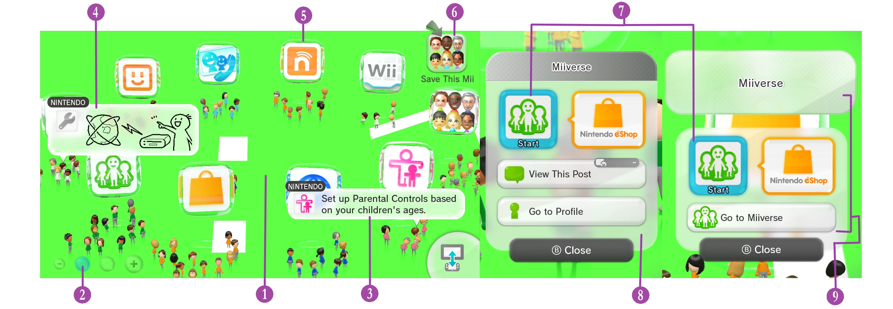

----------------------

### 1. Floor

{ width="426" height="240" }

`Men2.pack` > `Model` > `LoungeFloor.szs`

This is where the floor model is located

[Floor Guide](../themes/template.md#floor){ .md-button .md-button--primary }

----------------------

### 2. Button Scale

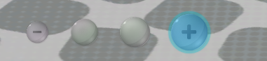

`Men.pack` > `Layout` > `BtnLoungeScale_00.szs`

??? "Glow"

    Go to `Men.pack` > `Layout` > `BtnLoungeScale_00.szs` > `BtnLoungeScale_00.bflyt`

    Change the color of the material `P_StaleIconGlow_00`

??? "Color"

    Go to `Men.pack` > `Layout` > `BtnLoungeScale_00.szs` > `BtnLoungeScale_00.bflyt`

    - In Animation Hierarchy open `BtnLoungeScale_00_Active.bflan`
    - Go to `Animation Info` > `PF_ScaleDotIndirect_00` > `MaterialColor`

    Change the `Key Frame 1` value of 

    - BlackColorRed
    - BlackColorGreen
    - BlackColorBlue

    and 

    - WhiteColorRed
    - WhiteColorGreen
    - WhiteColorBlue

    ??? question "What values do I use?"

        You can get your color in Hexadecimal values

        For example Pink (#FF8DA1)

        Then convert the RGB values to Decimal

        - FF = 255 for Red
        - 8D = 141 for Green
        - A1 = 161 for Blue
    
    ??? question "There's no Key Frame 1 in BlackColorRed"

        Right click `BlackColorRed` and select `Add Keyframe`
        
        Change the `Frame` value to 8

    Once you changed the values close the current window and open `BtnLoungeScale_00_Inactive.bflan`

    - Go to `Animation Info` > `PF_ScaleDotIndirect_00` > `MaterialColor`
    - Right click `BlackColorRed` and select `Add Keyframe` 
    - Change the `Key Frame 1` Frame to 8
    - Change the `Key Frame 1` Value to 0

    Now change the `Key Frame 0` value of 

    - BlackColorRed
    - BlackColorGreen
    - BlackColorBlue

    and 

    - WhiteColorRed
    - WhiteColorGreen
    - WhiteColorBlue

----------------------

### 3. Speech Balloon

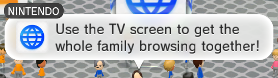

`Men2.pack` > `Layout` > `SpeechBalloon.szs`

??? "Balloon"

    You can change the [Color](../general/colors.md) of this by changing the materials:

    - `W_BalloonC`
    - `W_BalloonLT`
    - `P_Tip`

    To change or remove the transparency also change these materials:

    - `WF_BalloonC`
    - `WF_BalloonLT`

    If you want to change the [Color](../general/colors.md) of the title change:

    - `W_NameBaseC`
    - `W_NameBaseLT`
    
----------------------

### 4. Speech Balloon Drawing

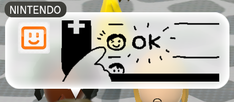

`Men2.pack` > `Layout` > `SpeechBalloonIllust.szs`

??? "Balloon"

    You can change the [Color](../general/colors.md) of this by changing the materials:

    - `W_BalloonC`
    - `W_BalloonLT`
    - `P_Tip`

    To change or remove the transparency also change these materials:

    - `WF_BalloonC`
    - `WF_BalloonLT`

    If you want to change the [Color](../general/colors.md) of the title change:

    - `W_NameBaseC`
    - `W_NameBaseLT`

??? "Text"

    Go to `RootPane` > `N_Trans` > `N_Scale` > `N_InBalloon`

    To change the color of the title of the Balloon

    - Go to `T_Name`
    - Go to `Text Pane`
    - In `Font` change the color

----------------------

### 5. App Floating Icon

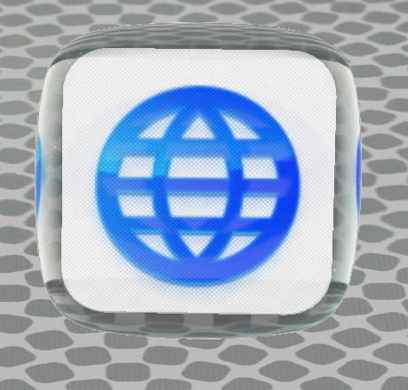{ width="200"}

`Men2.pack` > `Model` > `Cube00.szs`

----------------------

### 6. "Save This Mii"

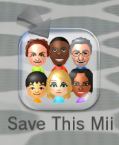

`Men2.pack` > `Layout` > `BtnMiiWindow_02.szs`

You can change the [Color](../general/colors.md) / [Texture](../general/textures.md) of this by doing changes to the materials inside of the bflyt file 

----------------------

### 7. App Launch

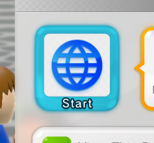

`Men2.pack` > `Layout` > `CommandLauncherIcon.szs`

You can change the [Color](../general/colors.md) of this by changing the material `ActiveFrame_01`

----------------------

### 8. Post Info

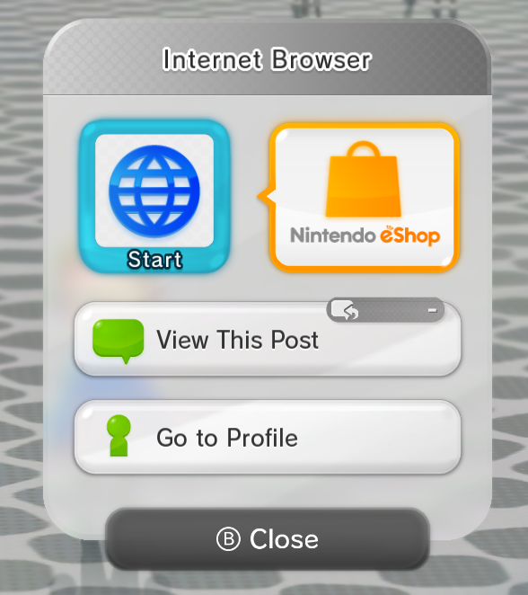{ width="250"}

`Men2.pack` > `Layout` > `CommandPosting.szs`

----------------------

### 9. App Info

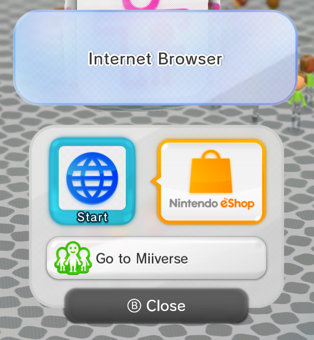{ width="250"}

`Men2.pack` > `Layout` > `CommandCube.szs`

----------------------

### 10. Button

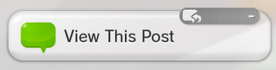

`Men.pack` > `Layout` > `BtnLoungeWindow_00.szs`

You can change the [Color](../general/colors.md) of this by changing the materials 

- `W_Shadow_01LT`
- `W_Shadow_01RT`
- `W_Shadow_01LB`
- `W_Shadow_01RB`

----------------------

### 11. Close Button

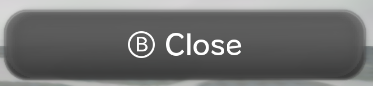

`Men.pack` > `Layout` > `BtnLoungeWindowClose.szs`

You can change the [Color](../general/colors.md) of this by changing the materials 

- `W_BtnDialogCloseC`
- `W_BtnDialogCloseLT`

----------------------