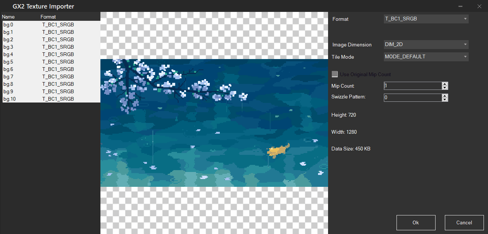
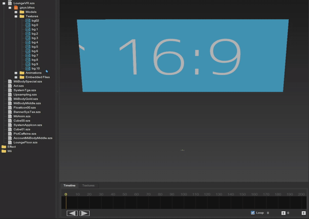

<link rel="stylesheet" href="../stylesheets/anim.css" />

# Texture Pattern Animations

<video controls>
<source src="../imgs/frame/vf.mp4" type="video/mp4">
</video>

-----------------------

## What you need

- [Switch Toolbox](https://github.com/KillzXGaming/Switch-Toolbox/releases/tag/Final).
- [Template](../template/index.md#template).

### Adding Frames

Open your model file (`LoungeVR.szs`, `LoungeFloor.szs`) with [Switch Toolbox](https://github.com/KillzXGaming/Switch-Toolbox/releases/tag/Final).

- Double click `gsys.bfres`.
- Right click the Textures folder.
- Press import.
- Select all of your frames -> Open.

    

    ??? info "Recommended Image Resolution"

        For `LoungeVR`: 1280x720 or less, anything higher is going to give you less space to work with and more likely to crash.

    ??? info "Max amount of Frames"

        - At 1280x720 you can get about 30 frames.
        - At 1138x640 you can get about 65 frames.
            - Note: This is the recommended amount for these resolutions before EU consoles start to crash.

        You can reduce the quality/resolution of the images to get more frames but you'll have to try and see what works before the Menu starts to crash.

    - Select all textures (with the first frame selected, shift+click the last frame).
    - Change the mip count to 1.

        

    - Make sure the format is set to `BC1_SRGB`.
    - Click OK.

Now that you've imported your frames, you need to create the animation file.

### Generating the Animation File

This step is required for your animation to work correctly.

- Choose which model is being animated.
- Set the framerate of your animation.
- Upload the animation frames.

??? info "Script info"

    Due to the way menu animations work, only values that are divisors of 60 are available.

!!! script "Animation Generator"

    

        <form id="gen-pat" class="animForm" autocomplete="off">
            
Model

            

                <input type="radio" id="vr" name="model" value="vr" required />
                <label for="vr">LoungeVR</label>
            

            

                <input type="radio" id="floor" name="model" value="floor" required />
                <label for="floor">LoungeFloor</label>
            

            

                <label for="fps" class="formLbl">Framerate (FPS)</label>
                <select class="formSel" name="fps" id="fps" required>
                    <option value="1">1</option>
                    <option value="2">2</option>
                    <option value="3">3</option>
                    <option value="4">4</option>
                    <option value="5">5</option>
                    <option value="6">6</option>
                    <option value="10">10</option>
                    <option value="12">12</option>
                    <option value="15">15</option>
                    <option value="20">20</option>
                    <option value="30" selected>30</option>
                    <option value="60">60</option>
                </select>
            

            

                <label for="fileupload" class="formLbl">Upload Frames</label>
                <input
                    type="file"
                    id="fileupload"
                    class="formSel"
                    accept=".bftex,.dds,.dds2,.png,.bmp,.tga,.jpg,.tiff,.tif,.gif"
                    multiple
                    required
                />
            

            <button type="submit">
                Generate Animation
            </button>
        </form>
    

!!! warning "Make sure the name of the exported animation ends in _auto or the animation will not work!"

After generating your animation file, go back to Switch ToolBox.

- Right click the Animations folder.
- Select **Import** -> `Texture Pattern Animation`.
- Open the animation file you previously generated.

!!! info "You can preview the animation by clicking the *Play* button"

    

!!! success

    Your custom animation has been added and you can now test it [StyleMiiU](../../install/loading.md#stylemiiu-plugin).
    
??? warning "Troubleshooting"

    If your theme is stuck in the Wii U Menu loading screen or a black screen.

    - You might not be importing the frames properly.

        - Make sure the format is set to `BC1_SRGB`.
        - Make sure to change the Mip count of **All frames** to 1.

    - You might be using too many frames/a really high resolution.

        - At 1280x720 you can get about 30 frames.
        - At 1138x640 you can get about 65 frames.
        