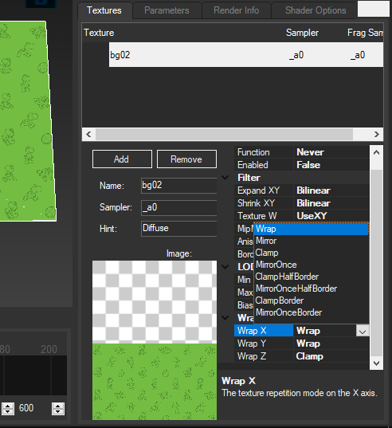
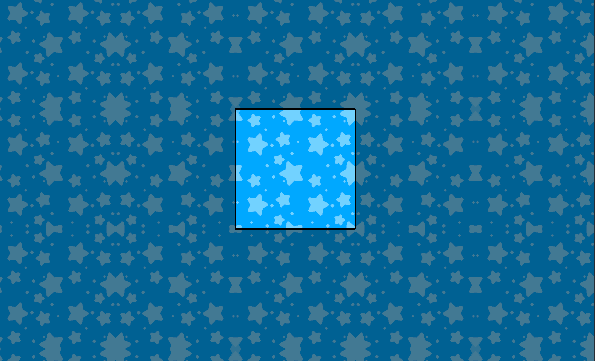
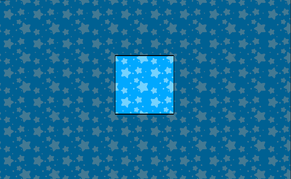

<link rel="stylesheet" href="../stylesheets/anim.css" />

# SRT Animations

-----------------------

## What you need

- [Switch Toolbox](https://github.com/KillzXGaming/Switch-Toolbox/releases/tag/Final).
- [Template](../template/index.md#template).

## Important info

For better results please use a seamless texture and do the following.

- Go to your model > `Materials` and select your material.
- Select the texture.
- Change `Wrap X` and `Wrap Y` from `Mirror` to `Wrap`.



??? question "Difference between Mirror and Wrap"

    Mirror repeats the texture by reflecting it:

    

    Wrap repeats the texture:

    

### Translate Texture Animations

<video controls>
<source src="../imgs/srt/translateprev.webm" type="video/mp4">
</video>

- Scrolls horizontally from left to right (Right to left if it's reversed).
- Scrolls vertically Up (Down if it's reversed).

!!! script "Translate Animation Generator"

    <div class="formContainer">
        <form id="gen-scr" class="animForm" autocomplete="off">
            <div class="formHdr">Model</div>
            <div>
                <input type="radio" id="vr2" name="model" value="vr" required />
                <label for="vr2">LoungeVR</label>
            </div>
            <div>
                <input type="radio" id="floor2" name="model" value="floor" required />
                <label for="floor2">LoungeFloor</label>
            </div>
            <div>
                <label for="speed" class="formLbl">Time before loop (Seconds)</label>
                <input class= "formInp"     type="number" id="scr-speed" required>
            </div>
            <div>
                <label for="direction" class="formLbl">Animation Type</label>
                <select class="formSel" id="scr-direction" name="direction">
                    <option value="Translate X" selected>Horizontal Scroll</option>
                    <option value="Translate Y">Vertical Scroll</option>
                </select>
            </div>
            <div style="font-weight: bold;">
                <label for="reverse">Reverse</label>
                <input type="checkbox" id="scr-reverse">
            </div>
            <button type="submit">
                Generate Animation
            </button>
        </form>
    </div>

!!! info "Themes using these animations"

    - [Splatoon Loading Screen - By Gatto](https://themezer.net/wiiu/themes/splatoon-loading-screen-5)
    - [From now on - By Gatto](https://themezer.net/wiiu/themes/from-now-on-36)
    - [Dark Sanctuary - By Gatto](https://themezer.net/wiiu/themes/dark-sanctuary-57)
    - [Mario Kart World - By Gatto](https://themezer.net/wiiu/themes/mario-kart-world-63)

### Scale Texture Animations

<video controls>
<source src="../imgs/srt/scaleprev.webm" type="video/mp4">
</video>

- A higher value means the texture will get smaller.
- A smaller value means the texture will get bigger.
- A negative value will flip the texture.
- Scale X affects the texture horizontally.
- Scale Y affects the texture vertically.

The following animation file will shrink the texure 1/4 of it's original size after 5 seconds, then it will grow back to normal.

``` YAML title="LoungeVR_auto.yaml" hl_lines="16-19 21-24" linenums="1"

Name: LoungeVR
Path: null
Loop: true
FrameCount: 600
MaterialAnimConfigs:
  - Name: m_00
    TexturePatternInfos: []
    ParamInfos:
    - Name: tex_mtx0
      IsConstant: true
      Constants:
      - Offset: Mode
        Value: 0
        CurveData:
        - KeyFrames:
            0: 1
            300: 2
            600: 1
            Offset: Scale Y
        - KeyFrames:
            0: 1
            300: 2
            600: 1
            Offset: Scale X

```

### Rotate Texture Animations

<video controls>
<source src="../imgs/srt/rotateprev.webm" type="video/mp4">
</video>

This animation will rotate the texture around the center of the UV Mapping.

!!! script "Rotate Animation Generator"

    <div class="formContainer">
        <form id="gen-rot" class="animForm" autocomplete="off">
            <div class="formHdr">Model</div>
            <div>
                <input type="radio" id="vr2" name="model" value="vr" required />
                <label for="vr2">LoungeVR</label>
            </div>
            <div>
                <input type="radio" id="floor2" name="model" value="floor" required />
                <label for="floor2">LoungeFloor</label>
            </div>
            <div>
                <label for="speed" class="formLbl">Time before loop (Seconds)</label>
                <input class= "formInp" type="number" id="rot-speed" required>
            </div>
                <input class="formInp" id="rot-direction" name="direction" value="Rotate" type="hidden">
            <div style="font-weight: bold;">
                <label for="reverse">Reverse</label>
                <input type="checkbox" id="rot-reverse">
            </div>
            <button type="submit">
                Generate Animation
            </button>
        </form>
    </div>

!!! info "Themes using these animations"

    - [Super Mario Oddysey - By Gatto](https://themezer.net/wiiu/themes/super-mario-odyssey-5B)

<script src="https://cdnjs.cloudflare.com/ajax/libs/js-yaml/4.1.0/js-yaml.min.js"></script>
<script src="../scripts/srt.js"></script>

### Importing Animations

After generating your animation file(s).

- Open your model file (`LoungeVR.szs`, `LoungeFloor.szs`) with [Switch Toolbox](https://github.com/KillzXGaming/Switch-Toolbox/releases/tag/Final).
- Right click the Animations folder.
- Select **Import** -> `Texture SRT Animation`.
- Open the animation file(s) you previously generated.

!!! warning "Make sure the name of the exported animation ends in `_auto` or the animation will not work!"

!!! question "Multiple Animation files"
    - You can have multiple animation files for the same material, make sure that additional animations end numbered sequentially the following way: `_auto`, `_auto.1`, `_auto.2`, `_auto.3`... and so on.
        - This is useful in case you want to have animations that loop at different times.

!!! success

    Your custom animation has been added and you can now test it [StyleMiiU](../../install/loading.md#stylemiiu-plugin).