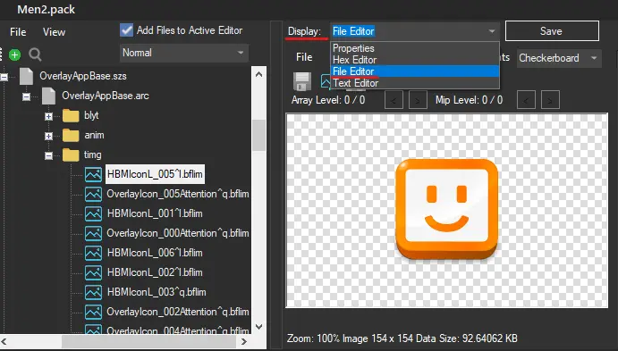
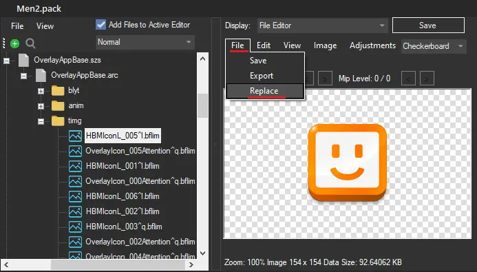
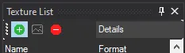

# Textures

## Replacing Textures

!!! note "For bfres"

    Open your file

    - Go to the `Textures` folder
    - Right Click the texture you want to replace
    - Click `Replace`
    - Select the image you want to use
    - Make sure the format is set to `BC1_SRGB`
    - Click OK
    - Save

!!! note "For bflyt"

    Open your file

    - Go to the `timg` folder
    - Click the texture you want to replace

    - In `Display` select `File Editor`

        

    - Click `File` then `Replace`

        

    - Select the image you want to use
    - Import it
    - Save

## Adding a new texture

!!! warning "If you are going to replace textures, please follow [Replacing Textures](#replacing-textures) instead"

!!! note "For bfres"

    Open your file

    - Right Click the `Textures` folder
    - Select the image or images you want to use
    - Select all textures (with the first frame selected, shift+click the last frame)
    - Change the mip count to 1
    - Make sure the format is set to `BC1_SRGB`
    - Click OK
    - Save

!!! note "For bflyt"

    Open your `bflyt` file

    - Click the green "+" button

        

    - Select your image
    - Change the format
    - Click OK

!!! failure "Don't delete default textures"

    This will cause issues, and will probably corrupt your theme, If you are going to replace textures, please follow [Replacing Textures](#replacing-textures) instead

## Change a Material's texture

- Open the Materials folder
- Select the Material you want to change the texture of
- Click on the Texture Maps tab
- Click Edit
- Choose the texture you want to use
- Click OK
- Save