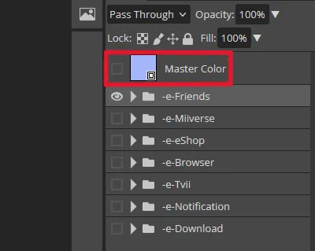
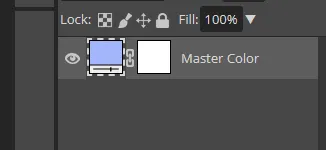
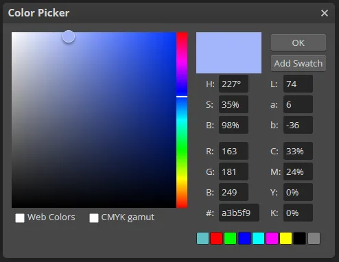
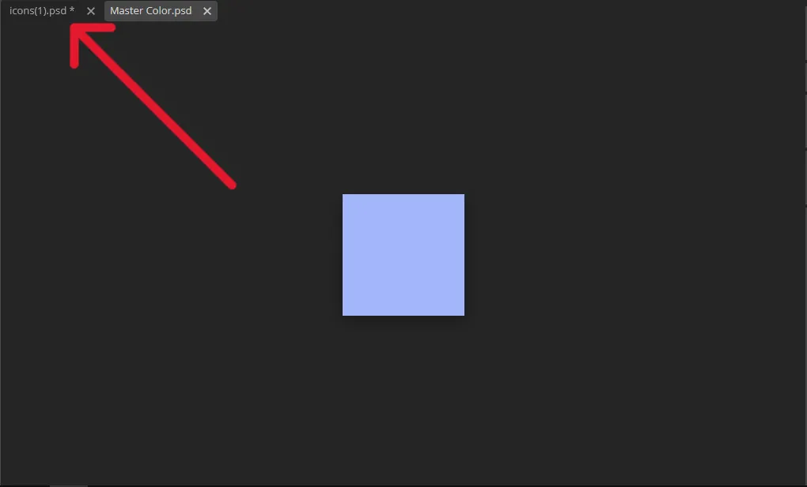
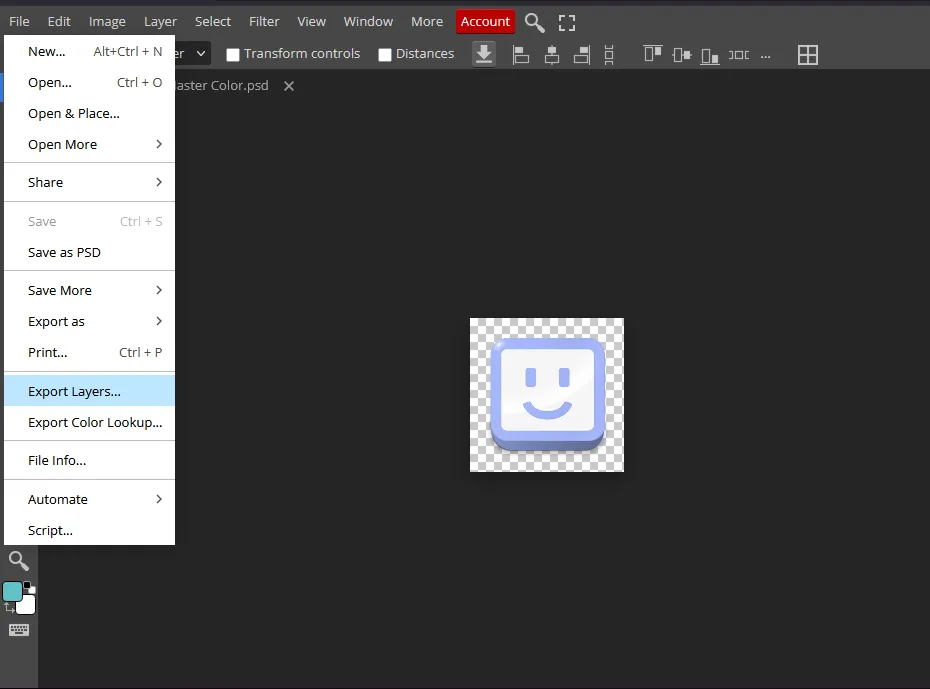
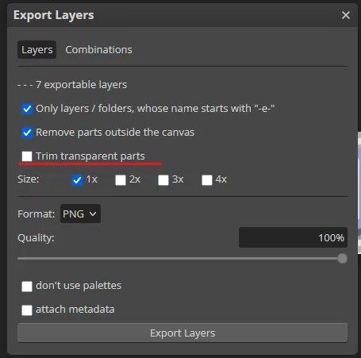

# Applets

----------------------

This will help you edit the applets icons to allow more customization

-   **Light Icons**

    

    [:fontawesome-solid-download: Download](files/applets/icons.psd){ .md-button .md-button--primary }
    [:fontawesome-solid-link: Link](https://www.photopea.com/#i7j3dHUQz){ .md-button }

-   **Dark Icons**

    

    [:fontawesome-solid-download: Download](files/applets/dark-icons.psd){ .md-button .md-button--primary }
    [:fontawesome-solid-link: Link](https://www.photopea.com/#iDQ7DLbgU){ .md-button }

We will be using [Photopea](https://www.photopea.com/) for this

This guide will be focused on changing the color of the applets

- Open [Photopea](https://www.photopea.com/) and select the file you downloaded
- Double-click the thumbnail preview of the `Master Color` layer

- Double-click the same thumbnail to open the color picker

- Save your changes ( `Ctrl + S` / `File -> Save` )

- Return to the icons.psd file

• Navigate to `File -> Export Layers...`

• Uncheck `Trim transparent parts`

• Press `Export Layers`

Your edited icons should now downloaded in a zip file, to use these textures [replace](../general/textures.md#replacing-textures) the originals with your new ones

You can also use these psd files to further modify the icons on your own to use images, gradients and more

