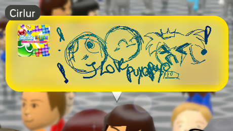
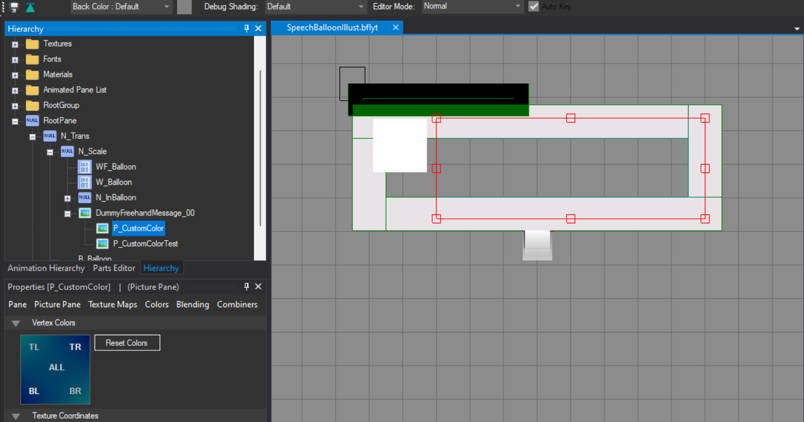

# Custom Color Illustrations

#### By: Space Cookie

-------------------------------------

So, you want some cool colors for your theme. But black is a bit too boring, No worries!

I made a custom preset you can patch onto your theme!

## What you need

- [SpeechBalloonIllust Custom Colors v2.0.bps](https://file.garden/ZyaG_W8sITLxB-in/Themes%20(Wii%20u)/SpeechBalloonIllust%20Custom%20Colors%20v2.0.bps)

or

- [SpeechBalloonIllust white.bps](https://file.garden/ZyaG_W8sITLxB-in/Themes%20(Wii%20u)/SpeechBalloonIllust%20white.bps)

## Getting your original file and starting up

1. Open your *unmodified* `Men2.pack`
2. Search `SpeechBalloonIllust`
3. Right-click and *EXPORT* raw data
4. Patch the `SpeechBalloonIllust.bps` file you downloaded
    - You can patch this file with
        - [Flips](https://github.com/Alcaro/Flips)
        - [Rompatcher.js](https://www.marcrobledo.com/RomPatcher.js/)
5. Save it on your device
7. Open the `Men2.pack` you want to modify
8. Search 'SpeechBalloonIllust' again
9. Right-click and *REPLACE* raw data

## Adding the color

!!! note

    If you're using a white speech balloon. Keep the sides white instead of transparent black.

1. Open the bflyt file in `SpeechBalloonIllust.szs`
2. Go into panes
3. Open in panes `Root pane > N_Trans > N_Scale > DummyFreehandMessage_00`
4. Inside `DummyFreehandMessage_00` there is `P_CustomColor` and `P_CustomColorTest`
5. Go into `P_CustomColorTest` and select some colors. After changing colors of the panes VERTEX COLOR, it should STAY INVISIBLE (Gradients are supported!).
6. Copy these vertex colors to `P_CustomColor`
7. Everything should be done!

??? note "More Personal Notes (YAY)"

    Sadly the colors are less bright but it works. I'm mad that i wasted hours... NO DAYS making this work. I just had so many theories how it worked, which resulted in messing with blending colors. Blending colors were crashing my console and even gave me an error! It was a painful and hard journey. But if you have questions/issues. Report them to me! [Space Cookie on Discord](https://discord.com/users/787002790534840321)
