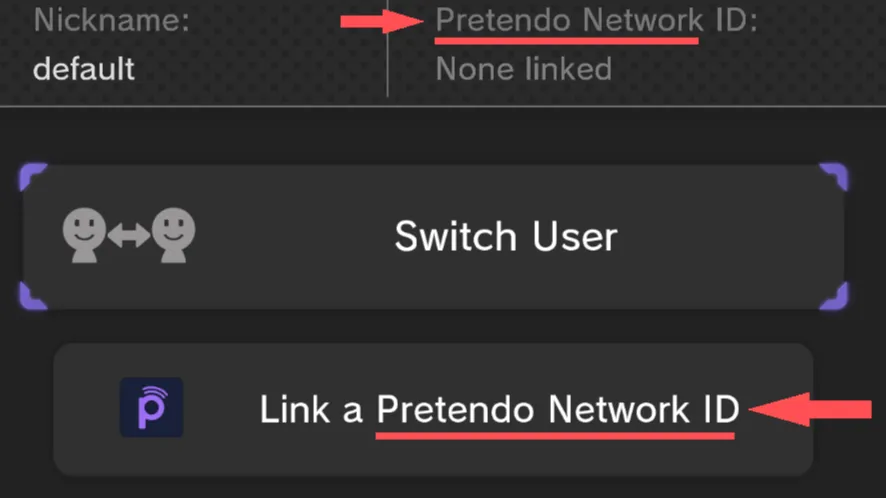

# Pretendo Text Patches

#### By: Nathaniel & dewgong64

----------------------

You can use these AllMessage BPS patch files to replace "Nintendo Network" instances with "Pretendo Network"

- [:fontawesome-solid-download: Download USA Language Patches](files/textpretendo/Pretendo_USA_Text.zip){ .md-button .md-button--primary }

- [:fontawesome-solid-download: Download EUR Language Patches](files/textpretendo/Pretendo_EUR_Text.zip){ .md-button .md-button--primary }

*Text Patches in Japanese are not available, if you would like to contribute please contact @nathaniel_s7 or @gatto_ysh via discord*

------------------------

## Installation

### What you need

- `AllMessage.szs` for the language you want to modify.

### Get your files

If you already have the `AllMessage.szs` file(s) you can skip this step.

You will need the `AllMessage.szs` file for the language you want to edit, if you do not have this file you can obtain it using any of the methods from [Menu Files](../../install/files.md) and get the file from the following location.

=== "JNUSTool"
    - `content > [LANGUAGE] > Message > AllMessage.szs`.
        - In `[LANGUAGE]` use the language you want to edit.
            - For example: `UsEnglish`.

=== "FTP"
    - `storage_mlc > sys > title > 00050010 > [REGION] > content > [LANGUAGE] > Message > AllMessage.szs`.
        - Depending on the region of your console, in `[REGION]` use
            - `10040100` for USA.
            - `10040200` for EUR.
            - `10040000` for JPN.
        - In `[LANGUAGE]` use the language you want to edit.
            - For example: `UsEnglish`.

### Patching

Go to [Patching](../../install/patching.md) or [Rompatcher.js](https://www.marcrobledo.com/RomPatcher.js/) and patch your original `AllMessage.szs` with the patch you downloaded previously

- Select your original `AllMessage.szs` file of the language you want to modify.
    - For example: `UsEnglish`.
- Select the `AllMessage.bps` file of the same language used in the previous step.
- Click Apply Patch.

### Loading Custom Text

You can load the text using either StyleMiiU-Plugin or SDCafiine.

=== "StyleMiiU-Plugin"

    - Place the patched `AllMessage.szs` file(s) in the following location
        - `SD:/wiiu/themes/[ThemeName]/content/[LANGUAGE]/Message/AllMessage.szs`

    - In `[ThemeName]` use the theme where you want to modify the text.
    - In `[LANGUAGE]` use the language you want to edit.
        - For example: `UsEnglish`.

=== "SDCafiine"

    - Place the patched `AllMessage.szs` file(s) in the following location
        - `SD:/wiiu/sdcafiine/[TITLEID]/[ThemeName]/content/[LANGUAGE]/Message/AllMessage.szs`

    - Replace `[TITLEID]` with the title ID of your region.
        - USA: `0005001010040100`
        - EUR: `0005001010040200`
        - JPN: `0005001010040000`

    - In `[ThemeName]` with the theme where you want to modify the text.
    - In `[LANGUAGE]` with the language you want to edit.
        - For example: `UsEnglish`

!!! success "Text that says Nintendo should be replaced with Pretendo!"
