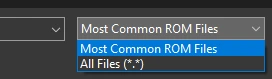
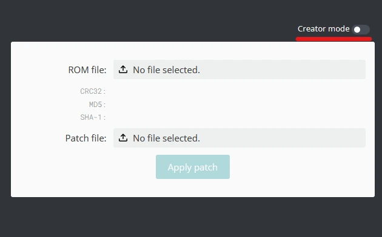

# Sharing

## Creating BPS Patch Files

If you want to share your themes, first you'll need to make them into a patch

=== "Flips"

    ## **Creating Patches with Flips**

    ### What you need

    1. [Flips](https://github.com/Alcaro/Flips/releases)
    1. Your ORIGINAL UNMODIFIED menu files
    2. Your modified file

    ### Guide

    1. Extract the zip files
    2. Open Flips.exe
    3. Click *"Create Patch"*
    4. Select your ORIGINAL UNMODIFIED file
        - You might need to change the setting here and select *"All files (*.*)"*

        

    5. Select your modified file
    6. Save your file
        - You should now see this

        

=== "Rompatcher.js"

    !!! bug ""

        The patches created using Flips instead of RomPatcher.js are much more optimized and prioritize efficiency over speed. It is strongly recommended using Flips to create your patches.

        Please only use this method in case you are unable to run Flips in your machine

    ## **Creating Patches with Rompatcher.js**

    ### What you need

    1. Your ORIGINAL UNMODIFIED menu files
    2. Your modified file

    ### Guide

    1. Go to [Rompatcher.js](https://www.marcrobledo.com/RomPatcher.js/)
    2. Click on creator mode
    
        
        

    3. In Original ROM select your ORIGINAL UNMODIFIED file
    4. In Modified ROM select your modified file
    5. Click on Create Patch

!!! success

    You are now ready to upload your theme to Themezer

## Uploading to Themezer

### What you need

- The BPS Patches of your theme
- A 720p Preview of your theme for the Launcher Menu (The menu with the Apps) and the Wara Wara Plaza (The menu with the Miis)
    - You can take a Screenshot of your theme using the [Screenshot Plugin](https://github.com/wiiu-env/ScreenshotWUPS)
    - Press X on the Wii U Menu to Swap screens and take both screenshots on the TV to get a 720p Screenshot
    - **Do not upload previews taken with your phone camera**

### Guide

- Go to [Themezer](https://themezer.net/)
- Log in with your Discord Account
- Go to `+ Create & Upload`
- Select Wii U
- Fill out the details, upload your files and share your theme!

!!! success

    Your theme is now available on Themezer!