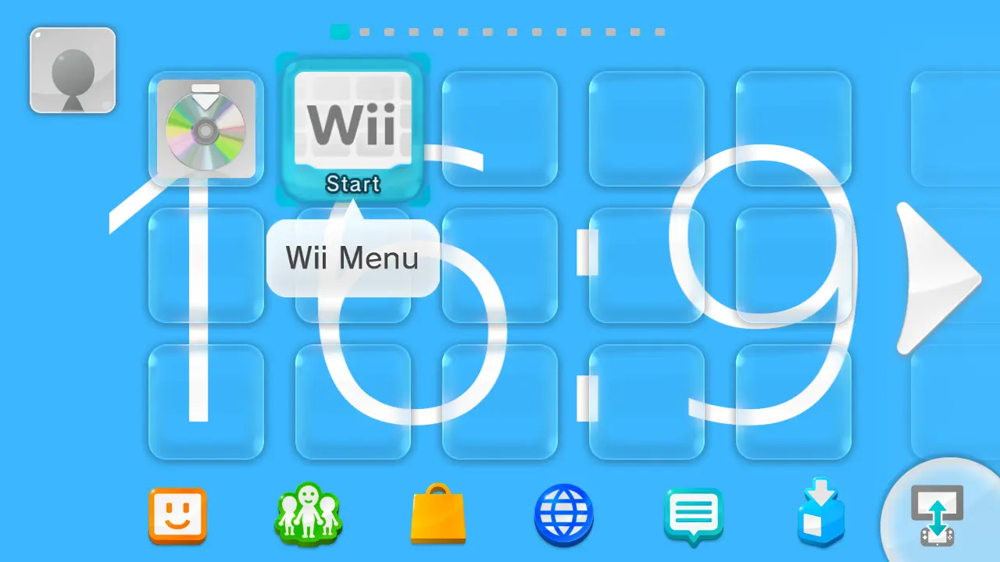
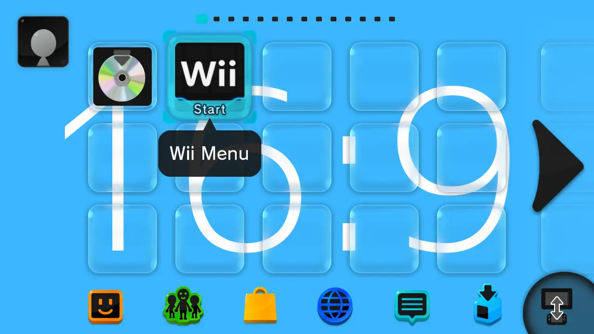
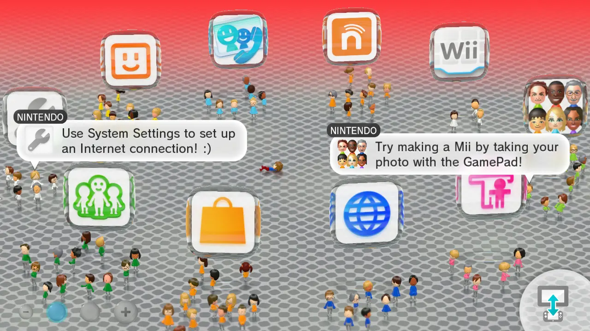

# Template

This is a Custom Theme

Custom themes can have a 2D non moving image, or be animated by adding texture animations to the models, themes can be created easily using a template.

-----------------------

## What you need

- [Switch Toolbox](https://github.com/KillzXGaming/Switch-Toolbox/releases/tag/Final)

### Template

We will be working with a template.

-   **Light Template**

    

    [:fontawesome-solid-download: Download Light Template](templates/Men2.bps){ .md-button .md-button--primary }

-   **Dark Template**

    

    [:fontawesome-solid-download: Download Dark Template](templates/DarkTemplate.zip){ .md-button .md-button--primary }

Apply the patch to a copy of your `Men2.pack` (and `Men.pack` if you are using the Dark Template) file ([Patching](../../install/patching.md)) and come back here when you're done.

- If you do not have these files, follow [Menu Files](../../install/files.md) to learn how to get them.

-----------------------

### Launcher

Open the patched `Men2.pack` template with [Switch Toolbox](https://github.com/KillzXGaming/Switch-Toolbox/releases/tag/Final)

- Go to `Common > Model > LoungueVR.szs > gsys.bfres > Textures`.
- Right click `bg02` and select `Replace`.
- Choose the image you want to use as background for the Menu.

    ???+ info "Recommended Image Resolution"

        1280x720

- When importing the image, import it in format `T_BC1_SRGB`.
- Save.

??? question "Where is this image displayed?"

    This image will be displayed here.

    
    
-----------------------

### Screen Transition

We are now going to change the image that's between the Wara Wara Plaza and the launcher.

- Go back to the `Models` folder.
- Go to `FloatIcon00.szs > gsys.bfres > Textures`.
- Right click `White_00` and select `Replace`.
- Choose the image you want to use as background for the Menu.

    ??? info "Recommended Image Resolution"

        1280x720.

- When importing the image, import it in format `T_BC1_SRGB`.
- Save.

??? question "Where is this image displayed?"

    This image will be displayed here.

    

-----------------------

### Floor

Now we need to change the texture of the floor.

There are two ways you can have the floor.

=== "Tiled"

    

    - Go back to the `Models` folder.
    - Go to `LoungeFloor.szs > gsys.bfres > Textures`.
    - Right click `Floor_Alb` and select `Replace`.
    - Choose the image you want to use as background for the Menu.

        ??? info "Recommended Image Resolution"

            1024x1024

    - Save.

=== "Stretched"

    

    - Go back to the `Models` folder.
    - Go to `LoungeFloor.szs > gsys.bfres > Models > LoungeFloor`.
    - Download the following floor model.

    [:fontawesome-solid-download: Download Stretched Floor Model](templates/LoungeFloor.dae){ .md-button .md-button--primary }

    - Right Click `Objects` and select `Import Static Object`.
    - Import using the `LoungeFloor.dae` you just downloaded.
    - Click `OK`.

    In Model Settings.

    - Uncheck `Use Material`.
    - Check `Enable Vertex Colors`.

    Now go to the `Inject Mode` Tab.

    - Check `Keep Original Skin Count`.

    Go back to the Model Settings tab and click Save.

    - Open the Objects folder.
    - Delete the `floor__m_floor` object.
    - Go back to Textures.
    - Right click `Floor_Alb` and select `Replace`.
    - Choose the image you want to use as background for the Menu.
    
    !!! warning "When importing the image, import it in format `T_BC1_SRGB`"

    ??? info "Recommended Image Resolution"

        2000x2000

    - Save.
    
    ??? question "Rotation"

        By default the image will be rotated, if you want to remove this rotation.

        - Open the `Materials` folder.
        - Select `m_floor`.
        - Go to the `Parameters` Tab.
        - Scroll down and click `tex_mtx0`.
        - Set `Rotation: X` to 0.
        - Click Ok.
        - Save.

### Gradient

There's also the option to use a gradient to make the transition between the screens smoother.

Still in `LoungeFloor.szs > gsys.bfres > Textures`.

- Right click `Gradient` and click `Export`.

You can edit the color of the gradient to your liking in the program of your choice, when you are done simply.

- Right click `Gradient`, click `Replace`.

Select your new texture and make sure you import it in format `TCS_R8_G8_B8_A8_SRGB`.

??? question "How does the gradient look like?"

    

??? note "If you do not want to use a gradient"

    *Right click* the next button and click `Save Link As...` and download the `Blank.png` file.

    [:fontawesome-solid-download: Download blank texture](imgs/Blank.png){ .md-button .md-button--primary }

    - Right click `Gradient` , Click `Replace` and select the blank texture you just downloaded.
    - Import it in format `TCS_R8_G8_B8_A8_SRGB`.

    The gradient should no longer be visible.

    

-----------------------

!!! info "Adding Animations"

    If you want to add animations to your theme follow

    [:material-star-shooting: Animations](../anim/index.md){ .md-button .md-button--primary }
    
!!! success

    Your Custom theme is now done.

    For more advanced changes go to

    [:octicons-gear-16: Advanced](../advanced/launcher.md){ .md-button .md-button--primary }