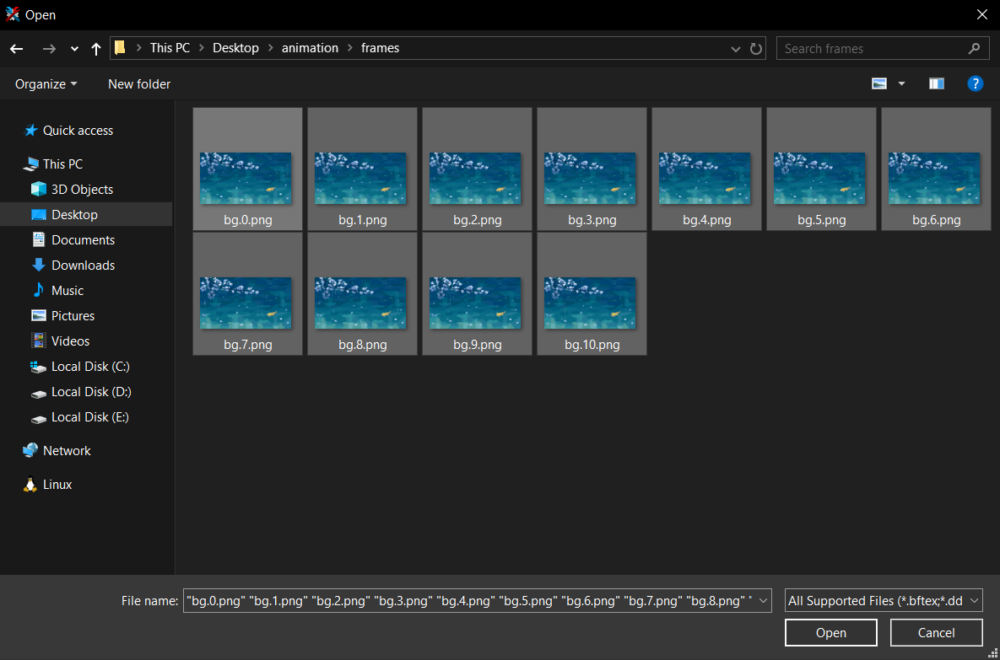
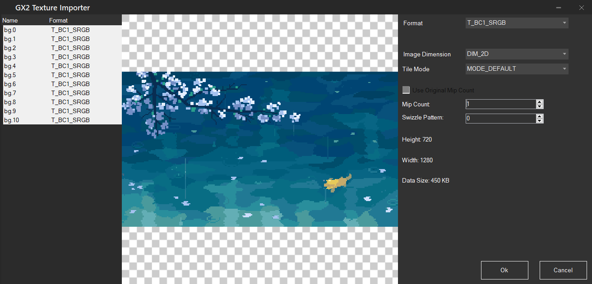
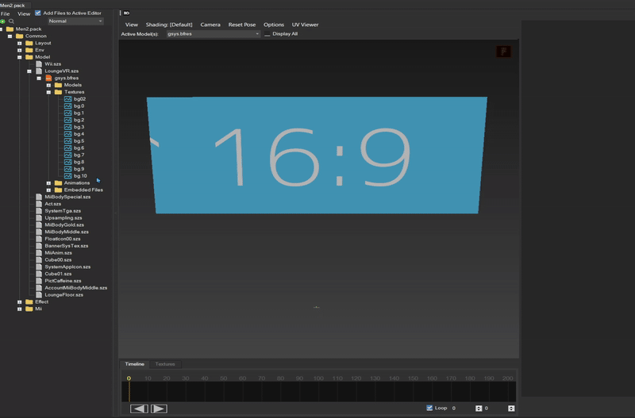

<<<<<<< HEAD
<link rel="stylesheet" href="/themecreation/themes/stylesheets/anim.css" />

=======
>>>>>>> b0cd672e18620ee4caeb5ca96b84f8eb0daf564e
# Animations

<video controls>
<source src="../imgs/frame/vf.mp4" type="video/mp4">
</video>

-----------------------

## What you need.

- [Switch Toolbox](https://github.com/KillzXGaming/Switch-Toolbox/releases/tag/Final)

### Adding Frames

Open `LoungeVR.szs` with [Switch Toolbox](https://github.com/KillzXGaming/Switch-Toolbox/releases/tag/Final)

- Double click `gsys.bfres`
- Right click the Textures folder
- Press import
- Select all of your frames -> Open

    

    ??? info "Recommended Image Resolution"

        1280x720 or less, anything higher is more likely to crash on console

    - Select all textures (with the first frame selected, shift+click the last frame)
    - Change the mip count to 1

        

    - Make sure the format is set to `BC1_SRGB`
    - Click OK

Now that you've imported your frames, you need to create the animation file

### Generating the Animation File

This step is required for your animation to work correctly

- Choose which model is being animated
- Set the framerate of your animation
- Upload the animation frames

<<<<<<< HEAD
=======

>>>>>>> b0cd672e18620ee4caeb5ca96b84f8eb0daf564e
??? info "Script info"

    Due to the way menu animations work, only values divisible by 60 are available.

!!! script "Animation Generator"
<<<<<<< HEAD

    === "Frame By Frame"

        

            <form id="gen-pat" class="animForm" autocomplete="off">
                
Model

                

                    <input type="radio" id="vr" name="model" value="vr" required />
                    <label for="vr">LoungeVR</label>
                

                

                    <input type="radio" id="floor" name="model" value="floor" required />
                    <label for="floor">LoungeFloor</label>
                

                

                    <label for="fps" class="formLbl">Framerate (FPS)</label>
                    <select class="formSel" name="fps" id="fps" required>
                        <option value="1">1</option>
                        <option value="2">2</option>
                        <option value="3">3</option>
                        <option value="4">4</option>
                        <option value="5">5</option>
                        <option value="6">6</option>
                        <option value="10">10</option>
                        <option value="12">12</option>
                        <option value="15">15</option>
                        <option value="20">20</option>
                        <option value="30" selected>30</option>
                        <option value="60">60</option>
                    </select>
                

                

                    <label for="fileupload" class="formLbl">Upload Frames</label>
                    <input
                        type="file"
                        id="fileupload"
                        class="formSel"
                        accept=".bftex,.dds,.dds2,.png,.bmp,.tga,.jpg,.tiff,.tif,.gif"
                        multiple
                        required
                    />
                

                <button type="submit">
                    Generate Animation
                </button>
            </form>
        

    === "Scrolling"

        

            <form id="gen-srt" class="animForm" autocomplete="off">
                
Model

                

                    <input type="radio" id="vr" name="model" value="vr" required />
                    <label for="vr">LoungeVR</label>
                

                

                    <input type="radio" id="floor" name="model" value="floor" required />
                    <label for="floor">LoungeFloor</label>
                

                

                    <label for="speed" class="formLbl">Scrolling Speed</label>
                    <select class="formSel" name="speed" id="speed">
                        <option value=1500>Very Slow</option>
                        <option value=800>Slow</option>
                        <option value=300 selected>Default</option>
                        <option value=125>Fast</option>
                        <option value=70>Very Fast</option>
                    </select>
                

                

                    <label for="direction" class="formLbl">Scroll Direction</label>
                    <select class="formSel" id="direction" name="direction">
                        <option value="X" selected>Horizontal</option>
                        <option value="Y">Vertical</option>
                    </select>
                

                

                    <label for="reverse">Mirror Scroll Direction</label>
                    <input type="checkbox" id="reverse">
                

                <button type="submit">
                    Generate Animation
                </button>
            </form>
        

=======
    

        <form id="generate-form" autocomplete="off" style="display: flex; flex-direction: column; gap: 14px;">
            
Model

            <label style="margin-left: 10px;">
                <input type="radio" id="vr" value="vr" name="model" required>
                LoungeVR
            </label>
            <label style="margin-left: 10px;">
                <input type="radio" id="floor" value="floor" name="model">
                LoungeFloor
            </label>
            

                <label for="fps" style="display: block; font-weight: bold; margin-bottom: 6px;">Framerate (FPS)</label>
                <select name="fps" id="fps" required style="width: 100%; padding: 8px; border-radius: 6px; border: 1px solid #ccc;">
                    <option value="1">1</option>
                    <option value="2">2</option>
                    <option value="3">3</option>
                    <option value="4">4</option>
                    <option value="5">5</option>
                    <option value="6">6</option>
                    <option value="10">10</option>
                    <option value="12">12</option>
                    <option value="15">15</option>
                    <option value="20">20</option>
                    <option value="30" selected>30</option>
                    <option value="60">60</option>
                </select>
            

            

                <label for="fileupload" style="display: block; font-weight: bold; margin-bottom: 6px;">Upload Frames</label>
                <input
                    type="file"
                    id="fileupload"
                    accept=".bftex,.dds,.dds2,.png,.bmp,.tga,.jpg,.tiff,.tif,.gif"
                    multiple
                    required
                    style="width: 100%; padding: 8px; border-radius: 6px; border: 1px solid #ccc;"
                />
            

            <button type="submit">
                Generate Animation
            </button>
        </form>
        
        
    

>>>>>>> b0cd672e18620ee4caeb5ca96b84f8eb0daf564e

!!! warning "Make sure the name of the exported animation ends in _auto or the animation will not work!"
After generating your animation file, go back to ToolBox

- Right click the Animations folder
<<<<<<< HEAD
- Select **Import** -> `Texture Pattern Animation` for frame based animations  
Alternatively, select `Texture SRT Animation` for scrolling animations
=======
- Select Import -> `Texture Pattern Animation`
>>>>>>> b0cd672e18620ee4caeb5ca96b84f8eb0daf564e
- Open the animation file you previously generated

!!! info "You can preview the animation by clicking the *Play* button"

    

!!! success

    Your custom animation has been added and you can now test it [SDCafiine](../../install/loading.md#__tabbed_1_1)
    