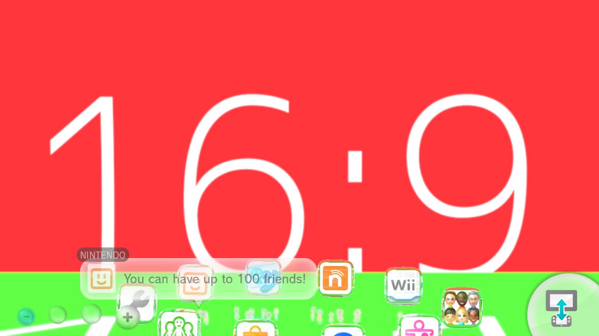
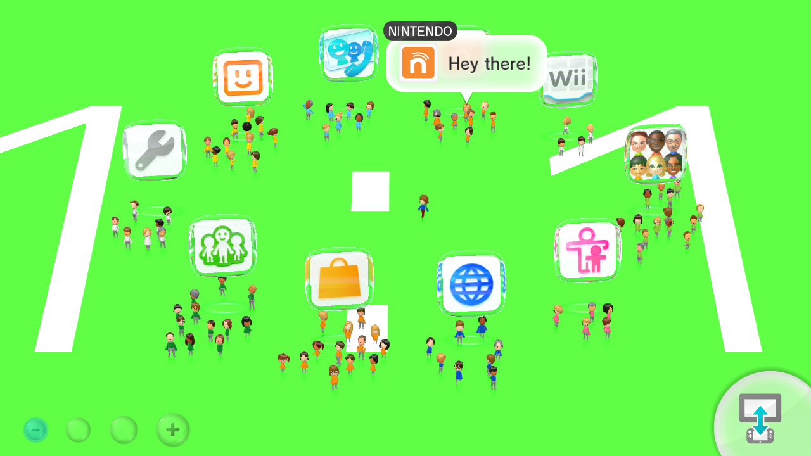

# Frame-based Animation

This is a Frame-based animated theme

<video controls>
<source src="../imgs/frame/vf.mp4" type="video/mp4">
</video>

This guide will be using a new way to make Frame-based animated themes

If you want to follow the old guide go to [Frame by frame](../../tutorials_old/framebyframe.md)

-----------------------

## What you need.

- [Switch Toolbox](https://github.com/KillzXGaming/Switch-Toolbox/releases/tag/Final)
- [TrackStudio](https://github.com/MapStudioProject/Track-Studio/releases)
- An animation with less than 38 frames

    ??? info "About more frames"

        Animations longer than 38 frames are possible but are more likely to crash on console, and the provided template only has 38 frames to work with

### Template

We will be working with this template

[Download Template (Frame-based)](templates/frame/Men2.bps){ .md-button .md-button--primary }

Apply the patch to a copy of your `Men2.pack` file ([Patching](../../../install/patching.md)) and come back here when you're done

### Exporting

Open the patched template with [Switch Toolbox](https://github.com/KillzXGaming/Switch-Toolbox/releases/tag/Final)

- Go inside Common
- Go inside Model
- Right click `LoungueVR.szs`
- Select *Export Raw Data*

    

- Save it

You can close Switch Toolbox for now

### Replacing Textures

Open `LoungueVR.szs` with [TrackStudio](https://github.com/MapStudioProject/Track-Studio/releases)

- Double click `gsys.bfres`
- Go inside Textures

- Now replace every frame that you are going to use with your images

    ??? info "Recommended Image Resolution"

        1280x720 or less, anything higher is more likely to crash on console

    - Right click the frame you are going to replace
    - Click Replace

        

    - Select your frame

    - Make sure the format is set to `BC1_SRGB`

        

    - Click OK

    And repeat with every frame of your animation

Now that you replaced all the textures you need, you need to change the animation file

### Changing the Animation File

This is needed so your animation can work as intended

- Set the framerate of your animation and the amount of frames it has

??? info "Script info"

    With the way this script works, only values divisible by 60 will work for the framerate.

    <form id="generate-form">
        <label for="framerate">Framerate (60,30,20,15,10,6,5):</label>
        <input type="number" id="framerate" required>
         
         
        <label for="frame-count">Frame Count:</label>
        <input type="number" id="frame-count" required>
         
         
        <button type="submit"><b>Generate Wait.json</b></button>
    </form>
    

!!! warning "Keep in mind that if the generated output is too long, it might crash and will not work"

??? question "Why is this needed"

    If you don't change the animation file, your animation will play at the wrong speed and will not loop properly

After you set your framerate and Frame count click on `Generate Wait.json`

This will generate a `Wait.json` file

- Go back to TrackStudio
- Go inside Animations
- Go inside Skeletal Animations
- Right click `Wait`
- Click Replace
- Replace it with the `Wait.json` file you just generated

You can preview the animation by clicking the *Play* button

<video controls>
<source src="../imgs/frame/vf2.mp4" type="video/mp4">
</video>

Finally save

- Click File
- Click Save

After saving, you can close TrackStudio

Now open the patched template with Switch Toolbox

- Go inside Common
- Go inside Model
- Right click `LoungueVR.szs`
- Select *Replace Raw Data*
- Replace it with the `LoungueVR.szs` we just saved
- Now click Save

You might want to change the background for the transition and the WaraWara plaza's floor

If so click below to expand

??? info "Click here to expand"

    - Go back the `Models` folder
    - Double click `FloatIcon00.szs`
    - Double click `gsys.bfres`
    - Go inside Textures
    - Right click `White_00` and select `Replace`
    - Choose the image you want to use as background for the Menu

        ??? info "Recommended Image Resolution"

            1280x720

    - Save

    ??? question "Where is this image displayed?"

        This image will be displayed here

        

    We still need to change one more image

    - Close `FloatIcon00.szs`
    - Go back to the `Models` folder
    - Double click `LoungeFloor.szs`
    - Double click `gsys.bfres`
    - Go inside Textures
    - Right click `Floor_Alb` and select `Replace`
    - Choose the image you want to use as background for the Menu

        ??? info "Recommended Image Resolution"

            2000x2000

    - Save

    ??? question "Where is this image displayed?"

        This image will be displayed here

        
        
    !!! success

        You are done

!!! success

    Your Frame-based animation is done and you can now test it [SDCafiine](../../../install/loading.md#sdcafiine)