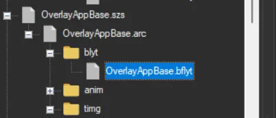
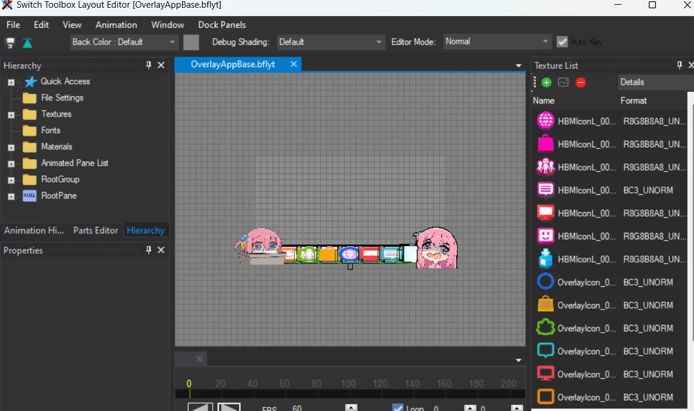
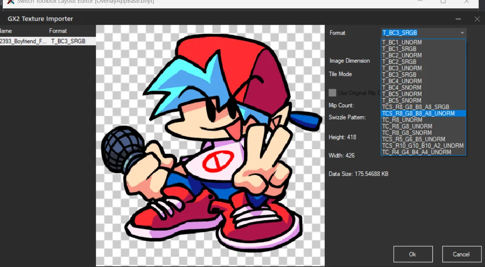
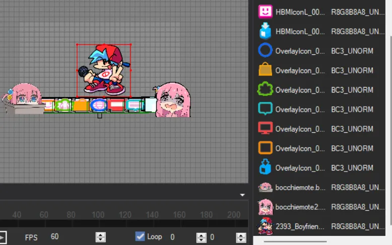
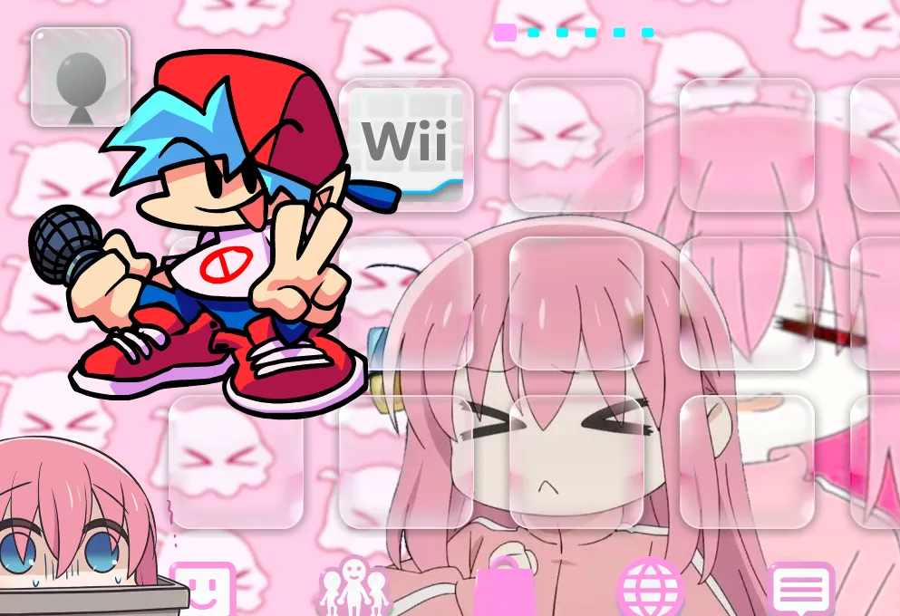

---
search:
  exclude: true
---

Layers:

When making themes you may want to add stickers / filters to your theme, so layers will come in handy

Here is a list of the files you may use to add images depending on each layer

> Infinite layer
> 
> 1-LauncherBase 
> 
> Special condition
> 
> 1- UsbIndicatorDrc
> 
> Layers:
> 
> 5-LauncherAccount
> 4-OverlayAppBase
> 3-LauncherPageIndicator
> 2-BtnSlideLauncher
> 1-FolderBase

What's the difference between **Infinite layers** and **layers**

**infinite layers**: are the parts of the theme that wont get off screen when swaping between the wara wara plaza and the apps screen

**layers**: are the parts of the theme that will get off screen when swaping between the wara wara plaza and the apps screen

*Here's an example of what i mean*

<video controls>
<source src="../imgs/layers/vl.webm" type="video/mp4">
</video>

**How can you add your own stickers?**

1. Choose the layer you want to work with

(For this example i'll be using **OverlayAppBase**)

2. Open **blyt**

3. Click the green button on the right corner **add button**

4. Select the picture you want to add and select the format **TCS_R8_G8_B8_A8_UNORM**

5.Grab the image, left click it, and move it over the screen

6. Save and profit

You will end up with something like this

