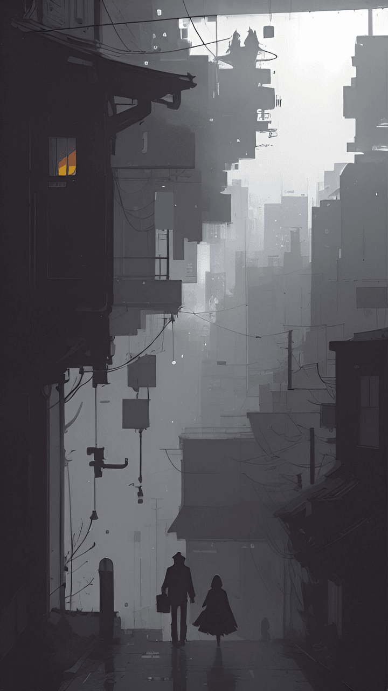

---
search:
  exclude: true
---

To make animated themes you **MUST** know how to make **static themes**

Animated themes can come in different ways

Scrolling, frame by frame, etc

I'll be making base themes for each new animation styles, but for this tutorial we will be using **Scrolling animation**

We  will be using this one as a base:

- [Pretendo Huevo](base/scrolling/HuevoPretendoIPS_2.zip){ .md-button } 

1. Open switch toolbox and go to **LoungeScaleMeter.bflyt**

2. Choose your scrolling image

for this tutorial we will be using this one

3. Add it like with **BC3_UNORM** format

4. Open **materials** and select **L_BtnLoungeScale_03**

edit

5. Now the good part, animating

If you want to leave it as it is now you can do that but ill explain how to animate anyways

Select **Animation Hierarchy** we will be using **LoungeScaleMeter_In.bflan**

An animation is made up by 3 important things

-TagInfo
-Animation Info
-**the animated part** on this case **L_BtnLoungeScale_03**

I dont know what the limit of **Frames** an animation haves, but i feel like 1000 to 2000 is enough or atleast for scrolling animations

you can change this on TagInfo and Animation Info

On TagInfo change the **Frame amount** in this case **-1000** to anything you like, do the same with Animation info

6. Now select the part we to animate

in this case **L_BtnLoungeScale_03**

**Translate Y** means it will only move on the **Y** axis

**Key Frames 0 to 2** means the position in which the image will be moving

Frame 0 = position A
Frame 1 = position B
Frame 2 = Back to position A

7. Select the **Key Frame** and edit

**Value** means the position

You can play with this as much as you want, it's all up to you

i'll save and show the final product

<video controls>
<source src="../imgs/scrolling/vs.mp4" type="video/mp4">
</video>

you can make it slower by increasing the amount of frames

Notes:

-You need an already existing part to animate, like something that is already on a theme that is animated, if you add a new one it wont work or atleast without doing some coding

-The curve type needs to be **hermite** or it wont work either, or atleast it didnt work for me lol